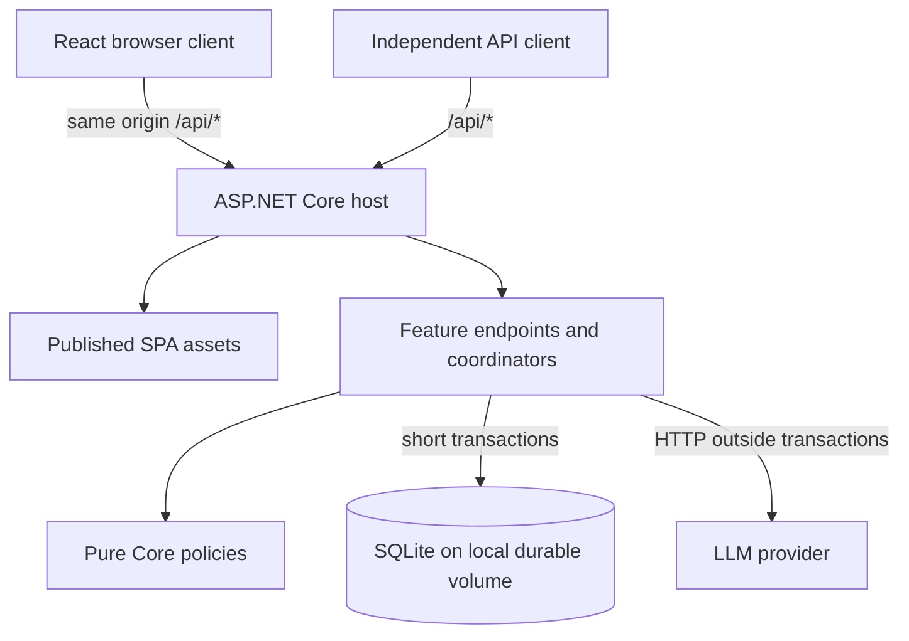

# LinguaDesk — Architecture and Engineering Principles

**Document:** #3 · **Version:** 1.13 · **Status:** Current design; implementation/evidence status is maintained in delivery/current.md and verification/coverage.md
**Updated:** 2026-09-09

## 1. Authority, Inputs, and Scope

Original authoring inputs are in the [archive](archive/03-architecture-inputs.md). Current scope follows the owning documents linked from [#0](00-SDD-Planning-Workflow.md).

PRD D-17/D-18 and Section 3 define current scope. P-001–P-004 retain their **newly amended** dispositions; P-005/NFR-008 and P-006 remain proposed. This document does not claim to close Q-001/Q-004/Q-008 in full. Active UX IDs remain behavioral contracts, not a mandatory browser-test count; Deferred/Retired IDs require no MVP implementation/evidence.

**Current feature boundary:** two explicit whole-text operations, plain editable/copyable results, one rewriting mode, native/inline UI, local accounts, two simple model chains, and an independent authenticated API. No sentence IDs, correspondence algorithms, assistance caches, rich-text/diff editor, debounce service, Google handler, priority rule engine, prefix processing, or dormant feature flags are required. Deferred features are designed when selected under PRD Section 3.1; do not prebuild their infrastructure.

## 2. Architecture Drivers and Stack Selection

- **Agent maintainability:** Explicit control flow, small dependency graphs, deterministic commands, and standard framework capabilities. Keep pure policy easy to test without a host.
- **API-first client independence (FR-035/FR-036):** The SPA and independent clients use the same authenticated operations and accounting.
- **Low operational overhead:** One application instance and one local durable relational database. This is the chosen MVP topology, not a product requirement to retain SQLite forever.

| Concern | Selected default | Tradeoff |
| --- | --- | --- |
| Backend | .NET 10 LTS, ASP.NET Core Minimal APIs | Pin a supported SDK patch; framework features before custom middleware/frameworks |
| Persistence | EF Core 10 and SQLite | Small deployment; one writer, short transactions, no multi-host database volume |
| Frontend | React, TypeScript, Vite | Two build toolchains, but one deployment; supports the simplified native-control UX |
| Tests | MSTest; Vitest + React Testing Library; Playwright | Most cases run without HTTP/browser; a small real-browser suite proves wiring and native behavior |

Use vertical feature slices without MediatR, generic repositories, a second Unit of Work, event buses, or speculative microservices. EF Core already provides persistence tracking and transactions. Introduce a boundary when it isolates an actual external effect or substantial policy, not one interface per class. No separate Node runtime, Redis, message broker, or orchestration platform is required for this topology.

## 3. System Topology and Repository Structure

### 3.1 Hosting



Vite produces assets packaged into `LinguaDesk.Api/wwwroot` before publish collects static files. The release contains the API and SPA in one artifact. Register API routes first and an explicit unmatched `/api` / `/api/*` error boundary before the SPA fallback; missing API routes must return an API 404, never `index.html`. Missing assets must also return 404. Use `MapFallbackToFile("index.html")` only for eligible client navigation paths. Local Vite proxies `/api` to the backend, preserving the same-origin cookie model without broad CORS configuration.

### 3.2 Repository shape

```text
LinguaDesk/
├── global.json                       # Pinned .NET SDK
├── .config/dotnet-tools.json          # Pinned EF CLI / local tools
├── docs/                             # Includes generated 05-openapi.yaml
├── scripts/                          # Thin build/check/contract entry points
├── backend/
│   ├── LinguaDesk.slnx
│   ├── Directory.Packages.props
│   ├── Directory.Build.props
│   ├── src/
│   │   ├── LinguaDesk.Core/           # Pure policy and value types
│   │   ├── LinguaDesk.Infrastructure.Ai/ # AI infrastructure: prompts, orchestration, IChatClient adapters
│   │   └── LinguaDesk.Api/
│   │       ├── Features/             # Translation, Rewriting, Identity, Usage
│   │       ├── Infrastructure/       # DbContext/migrations, durable AI admission, email adapters
│   │       └── Program.cs            # Composition, middleware, route registration
│   ├── tools/
│   │   └── LinguaDesk.Ai.Evaluation/  # Standalone fixture/live evaluation runner
│   └── tests/
│       ├── LinguaDesk.Core.Tests/     # Policy units, no host/database
│       ├── LinguaDesk.Infrastructure.Ai.Tests/ # Scripted IChatClient and provider transport fixtures
│       └── LinguaDesk.Api.Tests/      # Focused units, persistence and HTTP integration
└── frontend/
    ├── package.json / package-lock.json
    ├── src/
    │   ├── features/                 # Feature components, reducers, pure helpers
    │   ├── api/                      # Generated types + small fetch/auth wrapper
    │   └── shell/                    # Routing, auth context, layout
    └── tests/
        ├── unit/                     # Vitest units and DOM component tests
        └── e2e/                      # Browser contracts and small integrated smoke
```

This is a planned structure, not a claim that scaffolding or commands already exist. Do not create empty architectural layers to fill the tree.

## 4. Component Responsibilities and Representative Slice

### 4.1 Boundaries

- In the integrated design, `LinguaDesk.Api` references `LinguaDesk.Core` and `LinguaDesk.Infrastructure.Ai`; the AI infrastructure library references Core, never Api. Stage these edges with selected behavior: M004 may establish the nonempty Ai library before Core exists, and the API must not take an unused Ai reference. Add Core and the Ai→Core/API→Ai edges only when a selected shared value or consuming feature needs them; do not create an empty layer to satisfy the planned tree. Core references neither ASP.NET Core, EF Core nor AI/provider packages. Core holds counting/allowance calculations, state transitions and shared value types. The AI infrastructure library holds family-chain policy, prompt composition, eligibility/output validation and provider calls behind `Microsoft.Extensions.AI.IChatClient`. Time, configuration, and inputs are explicit arguments.
- AI integration belongs to the Infrastructure layer. Its separate library isolates provider dependencies and allows independent development and evaluation. The existing Api `Infrastructure/` folder retains host-specific persistence, admission and email integration; this naming does not require moving unrelated infrastructure into new projects. `LinguaDesk.Ai.Evaluation` remains a development tool that references `LinguaDesk.Infrastructure.Ai`.
- The API and standalone evaluation runner use the same Ai composition and operation pipeline. Ai has no HTTP-server, Identity, database or frontend dependency. A narrow attempt-admission boundary obtains permission and records monetary exposure for each provider dispatch; the API supplies durable accounting, while offline tests and isolated evaluation supply explicit substitutes. Ai success is provisional until the API commits character settlement. See #4 Sections 2, 6 and 9; this adds a library and development tool, not a deployed service.
- Endpoints handle transport, authentication/authorization, validation, and typed results. Simple CRUD can use `DbContext` directly. Multi-step paid operations use a small concrete feature coordinator so HTTP concerns do not swallow all testable policy.
- Coordinators call pure policy and concrete persistence operations. Use `IChatClient` for the AI provider boundary, a narrow email adapter and .NET `TimeProvider` at effect boundaries; replace these in tests. Do not mock `DbSet`/LINQ queries or Identity internals.
- Use built-in DI and typed `HttpClient` adapters. A scoped `DbContext` is never shared concurrently. Each independent transaction gets its own scope/context; awaited I/O remains asynchronous end to end.

### 4.2 Representative full rewrite

1. On explicit Rewrite activation (or an independent API call), authenticate a verified local account. Validate complete input length, supported selector values, the single mode and request identity against #5. Reject oversized input; never truncate it. Provider detection/eligibility follows admission within this requested operation, not via a typing-driven frontend pipeline.
2. In a short database transaction, claim the account-scoped operation key and reserve user/global character capacity and the next provider attempt's monetary exposure. Commit before any network call.
3. Execute provider HTTP and output validation outside the transaction, under the overall deadline and #4's bounded attempt policy.
4. In a second short transaction, conditionally finalize the operation. Valid success converts character reservations into one charge; definitive failure releases character capacity. Settle or conservatively retain monetary exposure separately. Commit before returning success.
5. Return the complete response and authoritative usage. The frontend reducer applies text only when workspace, input/settings, and result-edit revisions still match; outdated successes can update usage without replacing text.

The Ai pipeline performs language eligibility before transformation, including for manual source selection. The initial reservation in step 2 covers the eligibility call; each later dispatch gets separate monetary admission. Invalid eligibility releases character capacity without transformation. The family chain and maximum dispatch count are defined once in #4 Section 6.

## 5. Identity, API Boundaries, and Configuration

### 5.1 Identity

Use ASP.NET Core Identity for local accounts, password hashing and verification/reset tokens. LLM routes enforce verified-account authorization server-side. Google/external sign-in is DF-007: no OAuth callback, credentials, handler, linking flow or Google smoke requirement in MVP. Do not customize or fork Identity merely to remove unused framework-provided tables.

The SPA uses Secure, HttpOnly cookies and antiforgery validation; independent clients use Identity's protected opaque bearer tokens. [API design #5 Section 3](api/accounts.md#3-authentication-verification-and-account-lifecycle) selects credential precedence, expiry/refresh and security-stamp checks for both schemes; the auth slice must implement these explicitly rather than assuming framework defaults satisfy them. Do not build an OAuth server or describe the tokens as JWT/OIDC. Unverified accounts can complete the verification journey but cannot invoke LLM operations. Fix exact auth endpoints, antiforgery bootstrap and remaining account-policy/delivery details before their handlers/clients. A separate API client must work without loading the SPA.

Persist Data Protection keys outside the deployment directory with restricted filesystem access and a stable application identity. Back them up with account data. Local-account deletion and cookie/bearer session revocation need the Q-004 account design before implementation. External-account linking is a DF-007 dependency, not a current blocker; when selected it must not link solely by matching email. Real email delivery is an adapter; deterministic tests use a capturing fake.

**Account persistence boundary:** [Package 006](08-backlogs/M006/spec.md) adds only the standard durable Identity account/store, one anonymous registration operation, a narrow confirmation-delivery intent and the named current-state `VerifiedAccount` authorization policy. It uses Identity's standard string key and normalized unique email without roles, a custom profile, authentication schemes or the rest of `MapIdentityApi`. The account starts unconfirmed and no cookie/bearer credential is issued. Data Protection keys use the explicit absolute existing `Security:DataProtectionKeysPath`, default `/var/lib/linguadesk/keys`, with application name `LinguaDesk`; the path is outside publish/static content and key values are never exposed or logged. Capturing/failing delivery adapters are injected only by deterministic tests; the runtime default cannot perform live delivery.

**Verification persistence boundary:** [Package 007](08-backlogs/M007/spec.md) adds only anonymous body-based confirmation and resend operations. A dedicated named Data Protection email-confirmation provider has a 24-hour lifetime without changing the default password-reset provider. Registration and resend share a 60-second UTC attempt marker in the existing `AspNetUserTokens` table, serialized by the selected single-process account gate and recorded before delivery; no migration, queue or outbox is added. Delivery carries destination, opaque user ID and unpadded base64url code through the narrow adapter. M012 retains browser link consumption/status UX, M034 retains real email delivery/click evidence, and M008–M010 retain credentials, antiforgery and password recovery.

M006 also closes M003's database-dependent-serving handoff. Outside contract generation, an account-serving host validates before listening that the configured database already exists, opens read/write, is at the current migration and can obtain/roll back a bounded write transaction, and that the existing key directory is usable. It never creates, migrates, repairs, deletes or falls back. `GET /health/ready` reports only current database/key readiness and stays outside product OpenAPI; `GET /health/live` remains process-only. Build-time OpenAPI generation registers the actual route metadata but performs no database/key/email/listener effect and cannot expose a user-configurable production bypass. The new Identity migration follows the immutable M003 baseline. Account/key records remain durable pending Q-004's later deletion/backup-retention decision; M006 adds no deletion or retention promise, so that unresolved launch policy does not block this bounded creation slice.

### 5.2 Configuration and diagnostics

Bind validated typed options from configuration, environment variables, and local user secrets. Provider/email credentials stay exclusively on the backend. Pin supported dependencies; never commit secrets. Fail startup on an invalid operation-family chain, missing required credentials, unwritable durable storage, or missing cost bounds for paid serving. Each of the two chains requires one primary and permits at most one fallback; reject extra candidates instead of silently accepting an advanced chain. There are no route-priority/overlap settings to validate. An explicit local/test configuration supplies fakes without requiring production credentials.

Translation uses the same configured chain for all 12 directions; Rewriting uses its configured chain for all four languages and nine single-dropdown modes. Each configured candidate must qualify for every route/mode it serves. Preserve the PRD default-model preference subject to quality/performance/cost eligibility. Low-cost providers/models and provider-managed caching are allowed; no provider retention/no-training certification is required. Per-route rules, priorities and arbitrary-length candidate lists are deferred as DF-004. #4 specifies the simple primary/fallback policy first; it needs no generic rule DSL.

Use structured logs with an allowlist: opaque operation ID, operation type, duration, classified outcome, attempt number, and numeric usage/cost metadata. Disable request/response body logging and redact cookies, tokens, email-link queries, and provider error bodies. Do not attach submitted text to exceptions or traces. Health checks establish process/storage readiness without paid provider calls. Track failures, DB contention, outstanding monetary exposure, and cap suspension; exact operational alert thresholds remain with #6/#10, not an invented uptime SLA.

M001 introduces only process liveness at `GET /health/live`, with no dependency probes or product-readiness claim; storage readiness is required before database-dependent serving is introduced. Its scaffold can run over loopback HTTP without credentials or a certificate because it exposes no account/text operation. This does not relax HTTPS, Secure cookies or production serving validation for later features. The [M001 package](08-backlogs/M001/spec.md) specifies the bounded behavior; product OpenAPI still begins with the first selected product API slice.

## 6. Data Classification and Lifecycle

### 6.1 SQLite and migrations

Production uses a configurable path defaulting to `/var/lib/linguadesk/linguadesk.db` on a local persistent volume. Enable WAL and foreign-key enforcement, and choose a bounded busy timeout within request deadlines. WAL permits concurrent readers but only one writer. No network filesystem or simultaneous multi-instance writers are part of this design. Keep monetary amounts as integer fixed-point units with an explicit currency/scale; do not use floating-point arithmetic for caps.

Use EF migrations from the first persistent schema in normal local development, integration tests, and production. Generate/update an **unreleased** migration after a coherent model change, then inspect and test it before completing the feature. Applied/shared migrations are immutable; add a new one. Do not defer migration generation until after verification. CI checks for pending model changes.

`EnsureCreated` is permitted only for explicitly disposable prototypes or isolated tests that make no migration claims. It is not the default integration setup and must never initialize a database later passed to `Migrate`. No automatic `EnsureDeleted` on startup or on an ordinary developer database. Test cleanup owns only its uniquely created temporary paths.

For deployment, stop/drain the single instance, take a consistent backup, run the tested EF migration bundle once, and start the app after success. Normal serving and OpenAPI generation do not mutate schemas on startup. On migration failure, remain unavailable and use the verified recovery procedure; do not automatically downgrade or delete data. Back up with SQLite's backup mechanism or a stopped, consistent database; copying a live `.db` without its WAL is insufficient. Restore testing belongs in #6/#10.

**M003 staging — 2026-09-09:** The [durable-storage package](08-backlogs/M003/spec.md) establishes explicit local initialization, scoped runtime access and file-backed migration/restart checks. Its initial schema contains framework migration metadata only; account and ledger models arrive with their owning features. Ordinary shell startup remains free of database I/O, and runtime connections do not create a missing file. No storage-readiness endpoint is selected here. Add the storage availability/startup validation from Section 5.2 before introducing database-dependent serving; production migration bundles, backup/restore and operational readiness retain M040's evidence gate. This staging does not weaken the production deployment rules above.

M006 is the first owning database-dependent feature and implements the startup/readiness handoff. Ordinary serving now requires the current explicitly migrated database and existing usable key directory; contract generation retains the M003 lazy/no-effect boundary and registers route metadata without constructing those serving dependencies.

### 6.2 Privacy and retention (Q-004)

| Data | Location | Lifecycle |
| --- | --- | --- |
| Local accounts, Data Protection keys | Durable backend storage | Account lifecycle; exact deletion/backup retention remains Q-004 |
| Operation status, reservations, usage and cost metadata | SQLite; no text bodies | #5 Section 5 defines identity/replay expiry and fingerprint removal; aggregate, backup and unresolved-exposure retention remains Q-004 |
| Source/result and single-mode/language workspace settings | Per-tab browser memory | Cleared on UX #2 Section 3.4 boundaries |
| Provider request/response bodies | Backend transient memory | Only bounded active processing/delivery; no persistent result cache, queue payload, logs, or analytics |

Do not retain an unkeyed text hash as a harmless substitute for content. If #5 requires replay-payload matching, use a server-keyed fingerprint with bounded metadata retention and key lifecycle; never log it. Avoid text in URLs/history, storage, HTTP caches, or service workers; text-bearing/auth responses use `Cache-Control: no-store`.

Clear client references and invalidate the workspace generation on reset, sign-out, expiry, and navigation teardown. Use `pagehide` and defensive `pageshow` handling for bfcache; do not depend on the unreliable `unload` event or clear on ordinary tab backgrounding. Test actual restoration separately from synthetic event dispatch. Garbage-collected runtimes cannot promise immediate byte erasure; the contract is no durable text and no application restoration. Backend processing has its own bounded deadline even after disconnection, with no unbounded in-memory replay cache.

PRD D-18 removes provider retention/no-training eligibility requirements. NFR-004 still governs LinguaDesk’s own text storage/logging and workspace teardown; it makes no guarantee about provider retention or training use. Q-001 continues to resolve serving capability, quality/performance and monetary bounds.

The user clarified that caching is **provider-managed**. #4 records the selected provider's supported cache behavior and pricing; no LinguaDesk completed-response cache, new persistence layer or cache-lifetime decision is required. Provider cache savings affect provider expenditure, not FR-024/026's successful-character charging. Use conservative monetary reservations until a discounted charge is supported by the actual billing contract; a cache miss must still fit the cap. Workspace teardown and application `no-store` behavior stay unchanged.

## 7. Operations, Accounting, and Crash Recovery

### 7.1 Durable operation and reservation rules

- A unique `(account, operation key)` record owns one logical submission. Admission atomically checks committed usage **plus active reservations** against both user and global limits. Use database constraints and conditional updates; an in-process lock alone cannot provide crash-safe accounting.
- Persist metadata-only states such as reserved/in-flight, succeeded, failed, and interrupted/unknown. State transitions and any usage-ledger entry occur atomically; a unique operation charge and conditional finalization prevent double settlement. An in-flight duplicate observes status rather than dispatching another paid call. Status/replay reads enforce authenticated account ownership.
- Before each retry/fallback, reserve its own bounded cost. Character charging occurs once for a validated overall success; failed attempts do not consume character allowance. No generic HTTP retry/hedging policy may silently replay paid POSTs outside #4's coordinator.
- Use a server-controlled deadline and injected clock. A client disconnect is not proof of failure: bounded processing may finish and commit success. Confirmed overall failure/deadline expiry commits no character charge, and late provider responses cannot turn a terminal failure into success. Status reads never dispatch work.
- Follow #5 Sections 5–7 for identity/replay expiry, payload matching, cancellation, admission-day character settlement, per-attempt monetary month and ordered usage snapshots. Store the chosen period with reservations and settlement; never move or reset a reservation implicitly with the wall clock. Exact wire representation and persistence/concurrency evidence remain selected-slice work; slices cannot choose conflicting semantics.

### 7.2 Failure windows and limits of idempotency

| Failure window | Required recovery |
| --- | --- |
| Before admission commit | No dispatch and no charge; no durable operation may exist |
| After reservation commit, before or during provider call | Durable record survives; on restart reconcile orphaned attempts without replaying paid work automatically. Release character reservation when fenced against late settlement; retain potentially spent monetary exposure |
| Provider completes before success commit | Database cannot prove success. Reconcile metadata where the provider supports it; otherwise treat the interrupted operation as non-success for character charging and conservatively account for possible provider cost |
| Success commits before HTTP response reaches client | Repeated key/status reads report existing success/usage without another charge or dispatch. Result delivery is not guaranteed after transient text is lost |

A local DB transaction cannot make an external provider call exactly once. Do not claim that an idempotency key recovers rolled-back state or lost result text. #5 Section 6 defines metadata-only status/replay, including succeeded with output unavailable, terminal interrupted and unknown outcomes; the selected recovery slice supplies the precise wire/UI mapping. A new user-requested operation is distinct from retrying the existing key and may incur a new charge; recovery must not create it silently. Reuse the original key after ambiguous transport failure within its validity window; expiry never permits redispatch under that key.

Recovery uses the durable metadata and a bounded in-process reconciliation service; it does not need a persistent text queue or distributed job platform. Only the current operation owner may settle it. Recovery and timeout finalization must fence off late callbacks with the same conditional transitions used for success.

### 7.3 Monthly monetary ceiling

Admission enforces `known spend + unresolved exposure + new attempt upper bound <= configured cap` atomically across requests. The estimate covers all billable input, bounded output/reasoning tokens, and provider-specific charges for the two active operations. Any paid eligibility/detection attempt also needs cost admission even when no character charge results. Alternative context is deferred with DF-001; it adds no MVP accounting branch. An unknown price or unbounded billable attempt makes that configuration ineligible for paid dispatch. Release unused exposure only on authoritative evidence; a timeout can still cost money. Provider-side hard budgets, when available, are an additional backstop.

#4 must supply eligible price/billing bounds and fallback attempt budgets. #5 Section 7 assigns each attempt to its cost-admission UTC month and conservatively carries unresolved prior-month exposure into new-month admission; Q-001 still owns the actual cap amount, serving arrangement and verified billing attribution. This is a conservative application admission guarantee under those verified bounds, not a promise to control unrelated account spend or provider billing changes. Suspensions preserve the workspace and return #5's budget category.

## 8. Frontend and Agent Development Rules

### 8.1 Explicit actions and plain-text state

Use feature reducers and pure helpers for explicit-dispatch guards, request/workspace identity, usage ordering and manual-edit protection. Effects perform transport; reducers do not. Context suffices for auth/usage/shared workspace state. Native textareas/selects and inline settings implement the UI; no broad global state manager or editor framework is needed.

A valid explicit action captures input/settings/result-edit revision. Typing, pasting, mode/language changes, reconnect, usage reset and elapsed time never dispatch a transformation. Ignore activation while composing; do not queue an automatic post-composition request. Detection/eligibility can complete the same explicit submission only if its captured revisions still match. One unsettled operation per feature page suppresses duplicate UI activation; the backend still enforces concurrent-client integrity. Settings and both source/result text stay editable while processing; any intervening edit or editor compositionstart blocks stale text application, even if composition is later cancelled.

Full-result replacement uses request/workspace revisions, not sentence/version associations. Plain result editing needs no segmentation, merge/split matching, cached metadata or comparison state. Targeted metadata preservation is cut, not merely delayed. Future DF-001/DF-002 must invalidate all assistance metadata on any manual edit; design those features only when selected. Share canonical count fixtures across C#/TypeScript; reject over-limit full text consistently on both sides.

### 8.2 Reproducible feedback

- Pin the .NET SDK in `global.json`, central package versions, local EF tool, Node version, npm lockfile, schema generator, and browser runtime. Set nullable reference types, TypeScript `strict`, and a fixed analyzer level. Apply recommended .NET/ESLint checks to owned code; generated output has explicit exclusions. Avoid unrelated analyzer or dependency upgrades during a feature.
- Provide one documented entry point each for setup, fast checks, integration, contract generation, browser smoke, and publish. They must be noninteractive, work from a clean checkout, return useful exit codes, and clean up only owned processes/files. #10 records executable commands once implemented.
- Ordinary unit/API checks need no browser install, Docker daemon, external account, paid credentials, or frontend dev server. Backend-only builds do not invoke npm. The explicit publish command builds the frontend once and packages it with the host.
- Ai library builds, offline AI checks, prompt inspection and standalone evaluations do not start the API or require its database/authentication. Live evaluation is explicit, budgeted and separate from ordinary tests. It shares production AI code while leaving HTTP/accounting integration evidence to the owning suites; see #4 Section 9.
- New edge cases default to pure unit tests. Add an integration/browser test only for a boundary that a lower test cannot establish. Use assertions on behavior and data, not private method calls or large DOM snapshots.

### 8.3 API behavioral design and generated contract

Design shared API behavior in [#5](05-api-design.md), then specify each selected slice's operations and acceptance before its handlers. Do not create a backend or provisional YAML solely to finish planning documents. At the start of an API implementation slice, add its actual C# contracts/endpoint metadata, generate and review the OpenAPI shape, then implement handlers against it. Generate dependent client types before client adoption. Incomplete contracts/handlers remain explicitly under construction and must not ship as working APIs.

Generate only the selected subset of active local-account authentication, language/mode/usage, Translation and Rewriting operations and their errors/status recovery. Do not emit speculative alternatives/sentence schemas or Google flows. Cookie **and** independent-client bearer lifecycle remain current contracts; simplifying sign-in providers does not remove API access. The first generated artifact is not a claim that all MVP operations exist.

Follow document #0: `docs/05-api-design.md` owns shared behavior and `docs/05-openapi.yaml` is the reviewed generated wire artifact. C# DTOs/metadata own editable wire structure; selected specifications refine operation behavior without duplicating the full schema. Use .NET's `Microsoft.AspNetCore.OpenApi` plus `Microsoft.Extensions.ApiDescription.Server` for build-time generation, with explicit operation IDs, typed success/error DTOs, auth metadata, semantic descriptions and client-facing examples. Pin OpenAPI 3.1 for client-tool compatibility. Build-time generation emits JSON; the same contract command deterministically serializes it to the canonical YAML file using a pinned serializer, with no schema edits or second schema source. Generate without a live database, migrations, external network, or production secrets; build-time host startup must be side-effect free while preserving actual route registrations.

Use pinned `openapi-typescript` for TypeScript definitions and a small `openapi-fetch` wrapper for transport/credentials/antiforgery/errors. This keeps transport generation independent from React state management. Commit generated schema/types, mark them generated, and regenerate in one command before frontend typechecking. CI fails on unexpected drift; do not hand-edit generated output. Generated shape alone does not prove status codes, authorization, accounting semantics, or compatibility; focused contract tests and review still do. P-006 remains proposed.

## 9. Verification Strategy

The [verification plan #6](06-verification-plan.md) is the canonical execution owner. Architecture retains the selected MSTest/Vitest/Testing Library/Playwright stack, host-independent AI boundary, production database/migration guarantees and testability constraints in Sections 2–8. ADR-005/009/012 retain the rationale.

### 9.1 Layer ownership

Use [#6 Section 2](06-verification-plan.md#2-verification-layers-and-check-catalog) for the unit-heavy strategy and assertion allocation. This is risk-based verification, not a numeric coverage quota.

### 9.2 Deterministic integration harness

Use [#6 Section 3](verification/backend.md#3-deterministic-backend-and-independent-ai-verification) for isolated SQLite/TestServer/Kestrel, migration/restart, fake-time and provider/email harnesses. The tests must prove this document's production integrity constraints.

### 9.3 Execution and traceability

[#6 Sections 7–8](06-verification-plan.md#7-execution-gates-and-evidence) own inner-loop/PR/release gates, canonical coverage and evidence status. Current evidence is maintained separately in [delivery status](delivery/current.md).

## 10. Decision Records and Source Basis

[Document #9](09-architecture-decisions.md) records ADR-001–ADR-005 as amended, ADR-006 as superseded, ADR-007–ADR-009 for migration parity, short reservations and pyramid ownership, ADR-010 for the approved simplified MVP, ADR-011 for removal of provider retention/no-training gates, and ADR-012 for the shared host-independent AI pipeline. Earlier decision scopes follow PRD D-17.

Technical guidance checked on 2026-09-07; the choices above are LinguaDesk's application of it:

- [.NET support policy](https://dotnet.microsoft.com/en-us/platform/support/policy) — .NET 10 LTS baseline.
- [OpenAPI TypeScript](https://openapi-ts.dev/introduction) and [openapi-fetch](https://openapi-ts.dev/openapi-fetch/) — schema-driven types and a lightweight transport client.
- [EF Core: choosing a testing strategy](https://learn.microsoft.com/en-us/ef/core/testing/choosing-a-testing-strategy) — exercise real database behavior; avoid fake query semantics.
- [EF Core: EnsureCreated](https://learn.microsoft.com/en-us/ef/core/managing-schemas/ensure-created) and [applying migrations](https://learn.microsoft.com/en-us/ef/core/managing-schemas/migrations/applying) — transient creation differs from migrations; inspect/test deployment changes.
- [SQLite WAL](https://www.sqlite.org/wal.html) — one writer and local shared-memory/filesystem constraints.
- [ASP.NET Core integration testing](https://learn.microsoft.com/en-us/aspnet/core/test/integration-tests?view=aspnetcore-10.0) — in-process host and controlled dependencies.
- [ASP.NET Core OpenAPI generation](https://learn.microsoft.com/en-us/aspnet/core/fundamentals/openapi/aspnetcore-openapi?view=aspnetcore-10.0) — native runtime/build-time tooling.
- [Identity for API backends](https://learn.microsoft.com/en-us/aspnet/core/security/authentication/identity-api-authorization?view=aspnetcore-10.0) — cookie and proprietary token boundaries.
- [Vitest environments](https://vitest.dev/guide/environment.html) and [Playwright best practices](https://playwright.dev/docs/best-practices) — DOM test environment versus browser, isolation, and controlled third parties.

## 11. Handoffs and Readiness

| Question / owner | Remaining decision | Blocks |
| --- | --- | --- |
| Q-001, #4/#6 and owner configuration | Serving/provider-managed caching capabilities, models/settings meeting quality/performance/cost criteria, monetary cap amount; no retention/no-training gate | Paid serving and launch |
| Q-002, PRD D-17 | Targeted matching and toggle restoration resolved by removal; future assistance association is DF-001/002 | No current-MVP blocker |
| Q-003/Q-006, #5 with #3 | Shared semantics selected in #5; M006 verifies registration DTO/policy/delivery intent and account-serving readiness; auth bootstrap and confirmation/sign-in/token/recovery operations remain | Selected authentication/accounting/recovery handlers and dependent clients; generated review remains an early implementation gate |
| Q-004, account/privacy package with #3/#5/#10 | Recovery window/stamp rules in #5; M006 makes account/key persistence explicit without deletion/retention claims; backup/aggregate/unresolved-exposure retention, deletion and further logout guarantees/provider disclosure remain; external linking deferred DF-007 | Deletion/backup/related lifecycle features and launch, not M006 account creation |
| Q-007, #4 | Policy specified in #4; selected adapter/token bounds, executable prompt/validator fixtures and conformance evidence remain | Live provider orchestration readiness; offline policy work can proceed |
| Q-005, #6 | Verification design and coverage specified in [#6](06-verification-plan.md); executable evidence remains pending | Release acceptance |
| Q-008/Q-010, PRD then #3/#10 | P-005 safeguard scope and any additional operational thresholds | Adoption of proposed controls; no silent acceptance |
