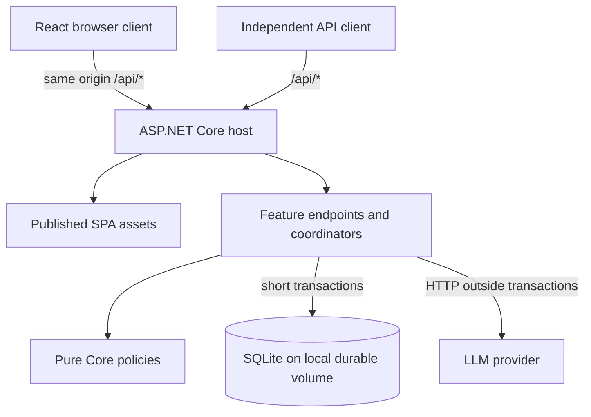

# LinguaDesk — Architecture and Engineering Principles

**Document:** #3 · **Version:** 1.1 · **Status:** Ready for scoped implementation planning; contract and launch dependencies remain
**Updated:** 2026-09-07

## 1. Authority, Inputs, and Scope

| Input | Recorded revision | Role |
| --- | --- | --- |
| [SDD Planning Workflow](00-SDD-Planning-Workflow.md) | v1.1, amended with this review; prior baseline `a07c0e2` | Process, document ownership, generated contract governance |
| [Product Requirements Document](01-PRD.md) | v0.2 at `a07c0e2` | Product baseline and proposal dispositions; unchanged by this review |
| [UX/UI Specification](02-ux-specification.md) | v1.1, amended with this review; prior baseline `a07c0e2` | Interface behavior and allocation of verification |
| Architecture and ADR review baseline | Git commit `a07c0e2` | Original architecture v1.0 and ADR-001–ADR-006 |

P-001–P-004 retain their accepted/amended PRD dispositions. P-005/NFR-008 (additional abuse safeguards) and P-006 (compatibility guarantees) remain proposed. This document defines technical defaults within accepted scope; it does not claim to close Q-001/Q-004/Q-008 in full. Section 11 names their remaining dependencies. Stable UX scenario IDs remain behavioral contracts, not a mandatory count of browser tests.

## 2. Architecture Drivers and Stack Selection

- **Agent maintainability:** Explicit control flow, small dependency graphs, deterministic commands, and standard framework capabilities. Keep pure policy easy to test without a host.
- **API-first client independence (FR-035/FR-036):** The SPA and independent clients use the same authenticated operations and accounting.
- **Low operational overhead:** One application instance and one local durable relational database. This is the chosen MVP topology, not a product requirement to retain SQLite forever.

| Concern | Selected default | Tradeoff |
| --- | --- | --- |
| Backend | .NET 10 LTS, ASP.NET Core Minimal APIs | Pin a supported SDK patch; framework features before custom middleware/frameworks |
| Persistence | EF Core 10 and SQLite | Small deployment; one writer, short transactions, no multi-host database volume |
| Frontend | React, TypeScript, Vite | Two build toolchains, but one deployment; preserves the drafted interactive UX |
| Tests | MSTest; Vitest + React Testing Library; Playwright | Most cases run without HTTP/browser; a small real-browser suite proves wiring and native behavior |

Use vertical feature slices without MediatR, generic repositories, a second Unit of Work, event buses, or speculative microservices. EF Core already provides persistence tracking and transactions. Introduce a boundary when it isolates an actual external effect or substantial policy, not one interface per class. No separate Node runtime, Redis, message broker, or orchestration platform is required for this topology.

## 3. System Topology and Repository Structure

### 3.1 Hosting



Vite produces assets packaged into `LinguaDesk.Api/wwwroot` before publish collects static files. The release contains the API and SPA in one artifact. Register API routes first and an explicit unmatched `/api` / `/api/*` error boundary before the SPA fallback; missing API routes must return an API 404, never `index.html`. Missing assets must also return 404. Use `MapFallbackToFile("index.html")` only for eligible client navigation paths. Local Vite proxies `/api` to the backend, preserving the same-origin cookie model without broad CORS configuration.

### 3.2 Repository shape

```text
LinguaDesk/
├── global.json                       # Pinned .NET SDK
├── .config/dotnet-tools.json          # Pinned EF CLI / local tools
├── docs/                             # Includes generated 05-openapi.yaml
├── scripts/                          # Thin build/check/contract entry points
├── backend/
│   ├── LinguaDesk.slnx
│   ├── Directory.Packages.props
│   ├── Directory.Build.props
│   ├── src/
│   │   ├── LinguaDesk.Core/           # Pure policy and value types
│   │   └── LinguaDesk.Api/
│   │       ├── Features/             # Translation, Rewriting, Identity, Usage
│   │       ├── Infrastructure/       # DbContext/migrations, provider/email adapters
│   │       └── Program.cs            # Composition, middleware, route registration
│   └── tests/
│       ├── LinguaDesk.Core.Tests/     # Policy units, no host/database
│       └── LinguaDesk.Api.Tests/      # Focused units, persistence and HTTP integration
└── frontend/
    ├── package.json / package-lock.json
    ├── src/
    │   ├── features/                 # Feature components, reducers, pure helpers
    │   ├── api/                      # Generated types + small fetch/auth wrapper
    │   └── shell/                    # Routing, auth context, layout
    └── tests/
        ├── unit/                     # Vitest units and DOM component tests
        └── e2e/                      # Browser contracts and small integrated smoke
```

This is a planned structure, not a claim that scaffolding or commands already exist. Do not create empty architectural layers to fill the tree.

## 4. Component Responsibilities and Representative Slice

### 4.1 Boundaries

- `LinguaDesk.Api` references `LinguaDesk.Core`; Core references neither ASP.NET Core nor EF Core. Core holds counting/allowance calculations, state transitions, and routing/output policies as they are specified. Time, configuration, and inputs are explicit arguments.
- Endpoints handle transport, authentication/authorization, validation, and typed results. Simple CRUD can use `DbContext` directly. Multi-step paid operations use a small concrete feature coordinator so HTTP concerns do not swallow all testable policy.
- Coordinators call pure policy and concrete persistence operations. Use narrow provider/email interfaces and .NET `TimeProvider` at effect boundaries; replace these in tests. Do not mock `DbSet`/LINQ queries or Identity internals.
- Use built-in DI and typed `HttpClient` adapters. A scoped `DbContext` is never shared concurrently. Each independent transaction gets its own scope/context; awaited I/O remains asynchronous end to end.

### 4.2 Representative full rewrite

1. Authenticate and require a verified account. Parse and validate the typed request against #5 and the configured routing policy.
2. In a short database transaction, claim the account-scoped operation key and reserve user/global character capacity and the next provider attempt's monetary exposure. Commit before any network call.
3. Execute provider HTTP and output validation outside the transaction, under the overall deadline and #4's bounded attempt policy.
4. In a second short transaction, conditionally finalize the operation. Valid success converts character reservations into one charge; definitive failure releases character capacity. Settle or conservatively retain monetary exposure separately. Commit before returning success.
5. Return the complete response and authoritative usage. The frontend reducer applies text only when workspace, input/settings, and result-edit revisions still match; outdated successes can update usage without replacing text.

## 5. Identity, API Boundaries, and Configuration

### 5.1 Identity

Use ASP.NET Core Identity for local accounts, password hashing, verification/reset tokens, and external-login mappings. Use Google's ASP.NET Core external authentication handler; LLM routes enforce verified-account authorization server-side.

The SPA uses Secure, HttpOnly cookies with appropriate SameSite settings and antiforgery validation for cookie-authenticated state changes, including logout. Google callbacks use the handler's correlation protection. Independent clients use the explicitly selected bearer scheme in #5; do not build an OAuth server or assume Identity's built-in opaque bearer tokens are JWT/OIDC tokens. Before the account slice is ready, #5 must fix issuance, expiry/refresh, revocation, and API 401/403 behavior for both schemes. A separate API client must work without loading the SPA.

Persist Data Protection keys outside the deployment directory with restricted filesystem access and a stable application identity. Back them up with account data. Never auto-link accounts solely because two providers return the same email; account linking/deletion and session revocation need the Q-004 account design before implementation. Real email delivery is an adapter; deterministic tests use a capturing fake.

### 5.2 Configuration and diagnostics

Bind validated typed options from configuration, environment variables, and local user secrets. Provider/OAuth/email credentials stay exclusively on the backend. Pin supported dependencies; never commit secrets. Fail startup on invalid enabled routes, ambiguous priorities, missing credentials, unwritable durable storage, or missing cost bounds for paid serving. An explicit local/test configuration supplies fakes without requiring production credentials.

Use structured logs with an allowlist: opaque operation ID, operation type, duration, classified outcome, attempt number, and numeric usage/cost metadata. Disable request/response body logging and redact cookies, tokens, email-link queries, and provider error bodies. Do not attach submitted text to exceptions or traces. Health checks establish process/storage readiness without paid provider calls. Track failures, DB contention, outstanding monetary exposure, and cap suspension; exact operational alert thresholds remain with #6/#10, not an invented uptime SLA.

## 6. Data Classification and Lifecycle

### 6.1 SQLite and migrations

Production uses a configurable path defaulting to `/var/lib/linguadesk/linguadesk.db` on a local persistent volume. Enable WAL and foreign-key enforcement, and choose a bounded busy timeout within request deadlines. WAL permits concurrent readers but only one writer. No network filesystem or simultaneous multi-instance writers are part of this design. Keep monetary amounts as integer fixed-point units with an explicit currency/scale; do not use floating-point arithmetic for caps.

Use EF migrations from the first persistent schema in normal local development, integration tests, and production. Generate/update an **unreleased** migration after a coherent model change, then inspect and test it before completing the feature. Applied/shared migrations are immutable; add a new one. Do not defer migration generation until after verification. CI checks for pending model changes.

`EnsureCreated` is permitted only for explicitly disposable prototypes or isolated tests that make no migration claims. It is not the default integration setup and must never initialize a database later passed to `Migrate`. No automatic `EnsureDeleted` on startup or on an ordinary developer database. Test cleanup owns only its uniquely created temporary paths.

For deployment, stop/drain the single instance, take a consistent backup, run the tested EF migration bundle once, and start the app after success. Normal serving and OpenAPI generation do not mutate schemas on startup. On migration failure, remain unavailable and use the verified recovery procedure; do not automatically downgrade or delete data. Back up with SQLite's backup mechanism or a stopped, consistent database; copying a live `.db` without its WAL is insufficient. Restore testing belongs in #6/#10.

### 6.2 Privacy and retention (Q-004)

| Data | Location | Lifecycle |
| --- | --- | --- |
| Accounts, external-login mappings, Data Protection keys | Durable backend storage | Account lifecycle; exact deletion/backup retention remains Q-004 |
| Operation status, reservations, usage and cost metadata | SQLite; no text bodies | Bounded replay/reconciliation window, then required aggregates only; exact durations remain Q-004/#5 |
| Source/result, comparisons, alternatives, workspace settings | Per-tab browser memory | Cleared on UX #2 Section 3.4 boundaries |
| Provider request/response bodies | Backend transient memory | Only bounded active processing/delivery; no persistent result cache, queue payload, logs, or analytics |

Do not retain an unkeyed text hash as a harmless substitute for content. If #5 requires replay-payload matching, use a server-keyed fingerprint with bounded metadata retention and key lifecycle; never log it. Avoid text in URLs/history, storage, HTTP caches, or service workers; text-bearing/auth responses use `Cache-Control: no-store`.

Clear client references and invalidate the workspace generation on reset, sign-out, expiry, and navigation teardown. Use `pagehide` and defensive `pageshow` handling for bfcache; do not depend on the unreliable `unload` event or clear on ordinary tab backgrounding. Test actual restoration separately from synthetic event dispatch. Garbage-collected runtimes cannot promise immediate byte erasure; the contract is no durable text and no application restoration. Backend processing has its own bounded deadline even after disconnection, with no unbounded in-memory replay cache.

Provider no-training terms and disclosed retention must be verified for every selected serving arrangement before launch (NFR-004). This document does not claim that verification has happened.

## 7. Operations, Accounting, and Crash Recovery

### 7.1 Durable operation and reservation rules

- A unique `(account, operation key)` record owns one logical submission. Admission atomically checks committed usage **plus active reservations** against both user and global limits. Use database constraints and conditional updates; an in-process lock alone cannot provide crash-safe accounting.
- Persist metadata-only states such as reserved/in-flight, succeeded, failed, and interrupted/unknown. State transitions and any usage-ledger entry occur atomically; a unique operation charge and conditional finalization prevent double settlement. An in-flight duplicate observes status rather than dispatching another paid call. Status/replay reads enforce authenticated account ownership.
- Before each retry/fallback, reserve its own bounded cost. Character charging occurs once for a validated overall success; failed attempts do not consume character allowance. No generic HTTP retry/hedging policy may silently replay paid POSTs outside #4's coordinator.
- Use a server-controlled deadline and injected clock. A client disconnect is not proof of failure: bounded processing may finish and commit success. Confirmed overall failure/deadline expiry commits no character charge, and late provider responses cannot turn a terminal failure into success. Status reads never dispatch work.
- #5 must fix replay expiry, payload mismatch behavior, cancellation, quota-period assignment for operations crossing midnight, and ordered usage snapshots before accounting implementation. Store the chosen period with reservations and settlement; never move or reset a reservation implicitly with the wall clock. These are contract dependencies, not permission for each slice to choose differently.

### 7.2 Failure windows and limits of idempotency

| Failure window | Required recovery |
| --- | --- |
| Before admission commit | No dispatch and no charge; no durable operation may exist |
| After reservation commit, before or during provider call | Durable record survives; on restart reconcile orphaned attempts without replaying paid work automatically. Release character reservation when fenced against late settlement; retain potentially spent monetary exposure |
| Provider completes before success commit | Database cannot prove success. Reconcile metadata where the provider supports it; otherwise treat the interrupted operation as non-success for character charging and conservatively account for possible provider cost |
| Success commits before HTTP response reaches client | Repeated key/status reads report existing success/usage without another charge or dispatch. Result delivery is not guaranteed after transient text is lost |

A local DB transaction cannot make an external provider call exactly once. Do not claim that an idempotency key recovers rolled-back state or lost result text. With no persisted output, #5 must define the recoverable status and output-unavailable response, and map it to UX #2's interruption behavior before implementation. A new user-requested operation is distinct from retrying the existing key and may incur a new charge; recovery must not create it silently. Reuse the original key after ambiguous transport failure.

Recovery uses the durable metadata and a bounded in-process reconciliation service; it does not need a persistent text queue or distributed job platform. Only the current operation owner may settle it. Recovery and timeout finalization must fence off late callbacks with the same conditional transitions used for success.

### 7.3 Monthly monetary ceiling

Admission enforces `known spend + unresolved exposure + new attempt upper bound <= configured cap` atomically across requests. The estimate covers all billable input (including alternative context), bounded output/reasoning tokens, and provider-specific charges. An unknown price or unbounded billable attempt makes that configuration ineligible for paid dispatch. Release unused exposure only on authoritative evidence; a timeout can still cost money. Provider-side hard budgets, when available, are an additional backstop.

#4 must supply eligible price/billing bounds and fallback attempt budgets; #5 defines month-boundary reservation assignment; Q-001 still owns the actual cap amount and serving arrangement. This is a conservative application admission guarantee under those verified bounds, not a promise to control unrelated account spend or provider billing changes. Suspensions preserve the workspace and return #5's budget category.

## 8. Frontend and Agent Development Rules

### 8.1 State and sentence correspondence

Use feature reducers and pure helpers for debounce decisions, request identity, usage ordering, manual-edit protection, and sentence metadata invalidation. Effects perform transport; reducers do not. Context is sufficient for auth/usage/shared workspace state; no broad global state manager by default.

Sentence splitting alone cannot preserve identities through insertions, deletions, merges, or splits. The rewriting package must implement affected-range correspondence against UX #2's existing fixtures, preserve unaffected opaque identities, and invalidate only the local ambiguous group. #5 defines how independent clients provide context/revisions without server-persisted text. Do not duplicate the same correspondence algorithm on client and server unless a concrete contract requires it; share cross-language counting/contract fixtures instead.

### 8.2 Reproducible feedback

- Pin the .NET SDK in `global.json`, central package versions, local EF tool, Node version, npm lockfile, schema generator, and browser runtime. Set nullable reference types, TypeScript `strict`, and a fixed analyzer level. Apply recommended .NET/ESLint checks to owned code; generated output has explicit exclusions. Avoid unrelated analyzer or dependency upgrades during a feature.
- Provide one documented entry point each for setup, fast checks, integration, contract generation, browser smoke, and publish. They must be noninteractive, work from a clean checkout, return useful exit codes, and clean up only owned processes/files. #10 records executable commands once implemented.
- Ordinary unit/API checks need no browser install, Docker daemon, Google account, paid credentials, or frontend dev server. Backend-only builds do not invoke npm. The explicit publish command builds the frontend once and packages it with the host.
- New edge cases default to pure unit tests. Add an integration/browser test only for a boundary that a lower test cannot establish. Use assertions on behavior and data, not private method calls or large DOM snapshots.

### 8.3 Generated API contract

Follow document #0's amended ownership rule: `docs/05-openapi.yaml` remains the reviewed contract artifact. Use .NET's `Microsoft.AspNetCore.OpenApi` plus `Microsoft.Extensions.ApiDescription.Server` for build-time generation, with explicit operation IDs, typed success/error DTOs, auth metadata, and semantic descriptions. Pin OpenAPI 3.1 for client-tool compatibility. Build-time generation emits JSON; the same contract command deterministically serializes it to the canonical YAML file using a pinned serializer, with no schema edits or second schema source. Generate without a live database, migrations, external network, or production secrets; build-time host startup must be side-effect free.

Use pinned `openapi-typescript` for TypeScript definitions and a small `openapi-fetch` wrapper for transport/credentials/antiforgery/errors. This keeps transport generation independent from React state management. Commit generated schema/types, mark them generated, and regenerate in one command before frontend typechecking. CI fails on unexpected drift; do not hand-edit generated output. Generated shape alone does not prove status codes, authorization, accounting semantics, or compatibility; focused contract tests and review still do. P-006 remains proposed.

## 9. Verification Strategy: Most Tests at the Bottom

### 9.1 Layer ownership

The broadest set of cases belongs to pure units, followed by focused DOM component tests. Integration suites are smaller and exercise real boundaries. Browser journeys are the smallest suite. This is a risk-based allocation, not a numeric coverage quota or an instruction to weaken data integrity checks.

| Layer | Owns | Does not establish |
| --- | --- | --- |
| MSTest pure units | Count/limit boundaries, reservation and settlement decisions, cost arithmetic, route precedence, failure classification, deadline policy with fake time | SQL atomicity, migrations, HTTP/auth wiring |
| Vitest pure units | Reducers, debounce decisions, stale-response ordering, revision/correspondence helpers, cache invalidation | Browser editing/layout |
| Vitest + Testing Library DOM components | Visible messages, forms, control state, effect request counts, usage rendering, semantic names/live-region mutations | Real clipboard, layout, bfcache, native IME, complete accessibility |
| EF/SQLite integration | Queries, constraints, transaction rollback, concurrent admission/settlement, crash recovery metadata, migrations | Provider language quality or browser behavior |
| MSTest HTTP integration (`WebApplicationFactory`) | Routing, validation, auth/antiforgery, error/usage serialization, independent API operations, unknown API paths | Actual socket/TLS/static publish behavior |
| Playwright browser contracts | Small keyboard/focus/clipboard/editing/history/privacy/reflow set and curated visual baselines per UX #2 | Server accounting when API responses are intercepted |
| Playwright integrated smoke | Published SPA → real API/auth → migrated SQLite → deterministic provider adapter; one Translation and one Rewrite/alternatives journey | Live Google/email/provider service reliability |
| Separate release evidence (#6) | Live identity/email smoke, provider quality/retention/cost eligibility, performance, manual browser/assistive-technology checks | Cannot be replaced by fixture success |

### 9.2 Deterministic integration harness

Use `WebApplicationFactory`/in-process `TestServer` by default for HTTP boundary tests. Direct persistence tests can construct `DbContext` without an HTTP host. TestServer removes listening-port conflicts; determinism and parallel safety still require isolated database paths, users/configuration, fake time, and controlled external responses.

Use the same EF SQLite provider and migrations as production. File-backed databases in unique temporary directories with WAL are required for concurrency, locking, crash/restart, and migration tests. Each concurrent request has its own context/connection; use barriers/deferred fakes rather than sleeps. SQLite in-memory may be used for focused relational cases without file/locking claims, with an explicitly owned connection lifetime; EF's InMemory provider and mocked `DbSet` are not substitutes. Tests may share helpers, not mutable cross-test state.

Test fresh migration and upgrade from the last released schema with representative account/ledger data; before the first release, test fresh schema plus any data-transforming migration with its prior schema. Assert retained data and constraints and check pending model changes. Simulate failures at Section 7.2's commit boundaries; a small process-restart test verifies persistence survives beyond the host instance.

Use fake provider/email adapters and sanitized transport fixtures for adapter parsing/error tests. Most authorization tests may use a controlled principal, but focused tests must use the real configured cookie/bearer handlers, antiforgery, verification gate, and token flows. A test-auth handler alone cannot prove authentication security.

Browsers cannot connect to in-memory TestServer. Integrated smoke therefore launches an owned Kestrel process on an OS-assigned/discovered port, with isolated migrated storage and test-only external adapters. Seed a verified local test account and exercise the real cookie login; use loopback HTTPS with a test certificate trusted only by the harness when exercising Secure cookies. Check readiness, dispose the process on failure, and never replace the browser's `/api` calls in this suite. Test adapters must be inaccessible in production configuration. Fixture-only browser contracts remain distinct.

### 9.3 Execution and traceability

- **Inner loop:** Relevant pure unit/component checks, typecheck, and analyzers. Run focused integration checks for changed data/HTTP boundaries.
- **PR gate:** All fast tests, backend build/integration, schema/client drift check, frontend production build, and the small integrated Chromium smoke. UI changes also run the affected browser contracts/curated visuals; harness/hosting/shared-style changes run the whole relevant browser set. If change selection is uncertain, run the relevant suite in full.
- **Release gate:** Add UX #2's targeted engine/device checks, actual published-host behavior, migration/restore and process recovery, measured workloads and provider evaluations from #6. Paid/non-deterministic evaluations stay outside the ordinary PR loop and cannot substitute for deterministic tests.

#6 maps every accepted requirement and UX-AC ID to executable checks, layer, environment, and evidence. Split a compound scenario by assertion: e.g., UX-AC-106's ordering algorithm is a unit, its displayed usage a component check, and its server sequence fields an API check. Do not rerun the entire scenario in each layer. A screenshot or backend test does not discharge unrelated UI assertions. All 112 UX IDs stay stable.

No runtime tests have been executed for this spec-only repository. Document validation is not implementation evidence.

## 10. Decision Records and Source Basis

[Document #9](09-architecture-decisions.md) records ADR-001–ADR-005 as amended, ADR-006 as superseded, and ADR-007–ADR-009 for migration parity, short reservations, and pyramid ownership.

Technical guidance checked on 2026-09-07; the choices above are LinguaDesk's application of it:

- [.NET support policy](https://dotnet.microsoft.com/en-us/platform/support/policy) — .NET 10 LTS baseline.
- [OpenAPI TypeScript](https://openapi-ts.dev/introduction) and [openapi-fetch](https://openapi-ts.dev/openapi-fetch/) — schema-driven types and a lightweight transport client.
- [EF Core: choosing a testing strategy](https://learn.microsoft.com/en-us/ef/core/testing/choosing-a-testing-strategy) — exercise real database behavior; avoid fake query semantics.
- [EF Core: EnsureCreated](https://learn.microsoft.com/en-us/ef/core/managing-schemas/ensure-created) and [applying migrations](https://learn.microsoft.com/en-us/ef/core/managing-schemas/migrations/applying) — transient creation differs from migrations; inspect/test deployment changes.
- [SQLite WAL](https://www.sqlite.org/wal.html) — one writer and local shared-memory/filesystem constraints.
- [ASP.NET Core integration testing](https://learn.microsoft.com/en-us/aspnet/core/test/integration-tests?view=aspnetcore-10.0) — in-process host and controlled dependencies.
- [ASP.NET Core OpenAPI generation](https://learn.microsoft.com/en-us/aspnet/core/fundamentals/openapi/aspnetcore-openapi?view=aspnetcore-10.0) — native runtime/build-time tooling.
- [Identity for API backends](https://learn.microsoft.com/en-us/aspnet/core/security/authentication/identity-api-authorization?view=aspnetcore-10.0) — cookie and proprietary token boundaries.
- [Vitest environments](https://vitest.dev/guide/environment.html) and [Playwright best practices](https://playwright.dev/docs/best-practices) — DOM test environment versus browser, isolation, and controlled third parties.

## 11. Handoffs and Readiness

| Question / owner | Remaining decision | Blocks |
| --- | --- | --- |
| Q-001, #4/#6 and owner configuration | Serving arrangement, no-training/retention evidence, eligible models and cost bounds, monetary cap amount | Paid serving and launch |
| Q-002, rewriting package/#5 | Sentence correspondence and opaque revision/context representation satisfying existing UX fixtures | Rewriting interaction implementation |
| Q-003/Q-006, #5 with #3 | Unicode counts, quota/month rollover, operation/status/replay/output-unavailable semantics, bearer lifecycle, error fields | Accounting/auth and their dependent clients |
| Q-004, account/privacy package with #3/#5/#10 | Metadata/replay/backup retention durations, deletion/linking, revocation, provider disclosure | Related account features and launch |
| Q-007, #4 | Output validity, provider error classes, attempt/deadline budgets | Provider adapter orchestration |
| Q-005, #6 | Coverage mapping, evaluation workload, actual evidence | Release acceptance |
| Q-008/Q-010, PRD then #3/#10 | P-005 safeguard scope and any additional operational thresholds | Adoption of proposed controls; no silent acceptance |

The topology, engineering defaults, and test allocation are ready for **scoped planning**. Documents #4–#6 need only resolve the contracts required by the selected package before its implementation; unrelated future decisions do not block independent work. This is not a claim of launch readiness or full resolution of privacy/cost questions.
