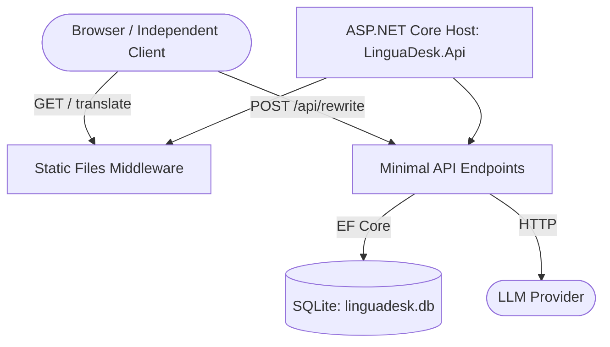

# LinguaDesk — Architecture and Engineering Principles

**Document:** #3 · **Version:** 1.0 · **Status:** Ready for implementation planning
**Updated:** 2026-09-07

## 1. Authority, Inputs, and Scope

| Input | Recorded revision (Git Commit) | Role |
| --- | --- | --- |
| [SDD Planning Workflow](00-SDD-Planning-Workflow.md) | `25077fe7e961d53ecf5c5bf3e3e067bdcb128417` | Process and document ownership |
| [Product Requirements Document](01-PRD.md) | `25077fe7e961d53ecf5c5bf3e3e067bdcb128417` | Product baseline and proposal dispositions |
| [UX/UI Specification](02-ux-specification.md) | `25077fe7e961d53ecf5c5bf3e3e067bdcb128417` | Interface layout, states, and accessibility |

**Decision Status:**
* Accepted: P-001–P-004 (incorporated in PRD/UX).
* Accepted: Targeted UX verification amendments reducing the automated browser test matrix while preserving observable UX behaviors and stable scenario IDs.
* Unresolved/Proposed: P-005/NFR-008 (additional security/abuse safeguards) and P-006 (API compatibility guarantees) remain proposals.
* Handoffs: Q-003/Q-006 to API (#5), Q-007 to LLM (#4), Q-002 coordinate with UX/API.

This document establishes the application topology, stack components, data lifecycle, engineering boundaries, and verification strategy, resolving the architecture components of Q-001, Q-004, and Q-008.

## 2. Architecture Drivers and Stack Selection

**Drivers:**
* **Reliability and maintainability by autonomous agents:** Favor explicit behavior, simple dependency graphs, and standard framework capabilities over deep abstractions.
* **API-First & Client independence (FR-036):** A unified API serving both the SPA and external clients.
* **Low Operational Overhead:** Single application instance, durable local database, self-contained deployment.

**Selected Stack:**
* **Backend:** .NET 10, ASP.NET Core Minimal APIs.
* **Persistence:** SQLite with Entity Framework (EF) Core.
* **Frontend:** React, TypeScript, Vite.
* **Testing:** MSTest (Unit/Integration), Vitest (Frontend Unit/Component), Playwright (E2E Journeys).

*Rationale against complexity:* We use vertical feature slices over MediatR or generic repository layers. Explicit EF Core usage inside endpoints keeps operations transparent. A single ASP.NET Core host serves both the API and static frontend assets, preventing the need for separate Node.js deployment or CORS management for the official client.

## 3. System Topology and Repository Structure

### 3.1 Topology



React/Vite builds to static files. These files are published into `LinguaDesk.Api/wwwroot`. The .NET app uses `MapFallbackToFile("index.html")` for SPA routing, avoiding separate frontend hosting.

### 3.2 Repository Tree

```text
LinguaDesk/
├── docs/
│   ├── 00-SDD-Planning-Workflow.md
│   ├── 03-architecture.md
│   └── 09-architecture-decisions.md
├── backend/
│   ├── Directory.Packages.props
│   ├── Directory.Build.props
│   ├── src/
│   │   ├── LinguaDesk.Core/          # Framework-independent domain policy/types
│   │   └── LinguaDesk.Api/           # Endpoints, EF Core context, Auth, SPA hosting
│   └── tests/
│       ├── LinguaDesk.Core.Tests/    # MSTest unit tests
│       └── LinguaDesk.Api.Tests/     # MSTest API integration & contract tests
└── frontend/
    ├── package.json
    ├── package-lock.json
    ├── vite.config.ts
    ├── src/
    │   ├── features/                 # Vertical slices (Translate, Rewrite)
    │   └── shell/                    # App routing, Auth context, Layout
    └── tests/
        ├── unit/                     # Vitest
        └── e2e/                      # Playwright journeys
```

## 4. Component Responsibilities and Representative Slice

### 4.1 Dependency Rules
* `LinguaDesk.Api` references `LinguaDesk.Core`.
* `LinguaDesk.Core` cannot reference ASP.NET Core or EF Core.
* Feature slices group related endpoints, requests, and handlers (e.g., `Features/Rewriting`).

### 4.2 Representative Slice: Full Rewriting
1. **Endpoint (`LinguaDesk.Api`):** Maps `POST /api/rewrites`. Authenticates the user.
2. **Validation & Policy:** Checks user and global character allowances using `LinguaDesk.Core` business logic, responding with a 402/429 equivalent if exhausted (exact code in #5).
3. **Persistence/Coordinator:** Opens an EF Core transaction. Records the request attempt.
4. **Provider Adapter:** Calls the LLM provider over HTTP (`HttpClient`).
5. **Success/Accounting:** Upon success, charges the user's daily usage ledger in the DB, commits the transaction, and returns the result text to the client.
6. **Frontend State Transition:** Reducer marks `status: 'Up to date'`, updates the local usage context, and resets manual-edit flags.

## 5. Identity, API Boundaries, and Configuration

### 5.1 Identity and Security
* **Authentication:** ASP.NET Core Identity. The SPA uses cookie-based authentication with Antiforgery (CSRF) protection. Independent clients will use a bearer token approach (details deferred to API Spec #5).
* **Google Sign-In:** Integrated via ASP.NET Core's external authentication handlers.
* **Data Protection:** Keys persisted durably alongside the database to prevent session invalidation across application restarts.

### 5.2 API Integration Boundaries
The frontend uses `/api/*` for all backend requests. SPA fallback applies only to non-`/api/` routes to avoid sending `index.html` on failed API requests.

### 5.3 Configuration & Secrets
* Configuration binds from `appsettings.json`, environment variables, and user secrets.
* **Secrets:** Provider keys and OAuth client secrets are never injected into the frontend build. They remain exclusively in backend configuration.
* **Limits:** Monetary cap limits and daily global allowance are backend configurations.

## 6. Data Classification and Lifecycle

### 6.1 Database and File Paths
* **Production Path:** `/var/lib/linguadesk/linguadesk.db`. This path must exist on a persistent host volume.
* **Mode:** SQLite WAL mode is enabled for concurrency.
* **Migrations & Rapid Iteration:** During rapid local development and test environment teardowns, agents must use `context.Database.EnsureDeleted()` and `context.Database.EnsureCreated()` to iterate on the schema statelessly. Generating official EF Core Migration files (via the .NET CLI) is strictly reserved as the **absolute final step** before completing a feature. Production deployments rely exclusively on `context.Database.MigrateAsync()`; `EnsureCreated()` is never used in production.

### 6.2 Data Classification & Privacy (Q-004)
| Data Type | Owner | Retention Trigger | Contains User Text? |
| --- | --- | --- | --- |
| Account & Keys | `LinguaDesk.Api` DB | User deletion | No |
| Usage Ledger | `LinguaDesk.Api` DB | Permanent / Aggregated | No |
| Temporary Text | SPA Memory | Tab close, reload, sign-out | Yes |
| LLM Requests | `LinguaDesk.Api` (Transient) | Dropped after request | Yes (Transient only) |

**Privacy rules:** LinguaDesk does not persist source or result text in its database, logs, or analytics. The active workspace lives purely in browser memory. Browser `unload` clears it, and `bfcache` restoration must explicitly reset state.

## 7. Operations, Accounting, and Crash Recovery

### 7.1 Accounting Rules
* **Single Charge:** Successful operations are charged once. Retries and failures do not count.
* **Atomicity:** Validations against global and user allowances occur in the same transaction that issues the LLM call reservation, or using a lock/atomic update upon completion.
* **Idempotency:** A client-provided idempotency key prevents duplicate charges if the client disconnects and retries after the backend succeeds.

### 7.2 Monetary Cap and Crash Recovery
* **Monetary Cap:** Limits total service provider expenditure. Evaluated before any LLM dispatch.
* **Crash Recovery:** If the process crashes during an LLM call, the uncommitted EF transaction rolls back. The client's idempotency key ensures that if the provider succeeded but the client never got the response, a retry will not double-charge, though the provider cost was already incurred. Unresolved provider charges are reconciled periodically if supported by the provider, but character quotas are protected by the DB transaction.

## 8. Frontend State and Engineering Rules

### 8.1 State and Sentence Correspondence (Q-002)
* Local React state (or reducers) holds the workspace text and metadata.
* Sentence correspondence for Rewrite edits operates by tokenizing boundaries locally. Manual edits increment a local `editRevision`. Asynchronous responses targeting an older revision are discarded to protect user edits.

### 8.2 Engineering Rules
* **.NET:** Central Package Management (`Directory.Packages.props`). Nullable reference types enabled. `10-recommended` analyzers.
* **Frontend:** TypeScript `strict`, ESLint flat config with `recommendedTypeChecked`. No broad global state managers unless proven necessary; simple Context + reducers preferred.
* **OpenAPI (Auto-Generated):** To eliminate manual YAML synchronization errors, the OpenAPI specification is auto-generated from C# Minimal APIs at build/startup. Frontend TypeScript clients are automatically generated from this output.

## 9. Verification Strategy

Following the authorized targeted UX verification amendments (see Document #2), testing is distributed to the most efficient layer:

| Risk / Invariant | Verification Layer | Change Trigger |
| --- | --- | --- |
| Accounting, Quotas, Idempotency | MSTest API Integration (`WebApplicationFactory`) | Backend logic/API changes |
| Database schema / Migrations | MSTest API Integration (`WebApplicationFactory`) | Entity/Migration changes |
| State machines, Reducers, Validation | Vitest (Unit/Component) | Frontend state logic changes |
| Core focus, navigation, clipboard | Playwright (Chromium Desktop) | UI structure / Core Journey changes |
| Visual regression (Core states) | Playwright (Chromium Desktop & Narrow) | Styling / layout changes |
| Language quality, Provider limits | Manual / External Evaluation (Doc #6) | Provider/Prompt changes |

*All backend API Integration tests enforce the use of `WebApplicationFactory`. This spins up an in-memory TestServer, ensuring zero TCP port collisions, parallel execution, and purely deterministic feedback for the agent. Playwright executes real frontend integration but mocks external providers.*

## 10. Consequential Decisions and Handoffs

### 10.1 Technical Decisions
*(Detailed further in `docs/09-architecture-decisions.md`)*
1. **ADR-001:** Combined Hosting and SPA Fallback.
2. **ADR-002:** SQLite WAL on durable volume with EF Core Migrations.
3. **ADR-003:** API-first minimal APIs over generic abstractions.

### 10.2 Unresolved / Handoffs
* **Q-002 (Sentence Mechanics):** UX is resolved; algorithmic identifier matching handed off to implementation / #5 API spec.
* **Q-003 / Q-006 (API Schema & Error Taxonomy):** Handled via C# type definitions and auto-generated OpenAPI integration (replaces manual `docs/05-openapi.yaml`).
* **Q-007 (LLM Prompts/Routing):** Handed off to `docs/04-llm-specification.md`.
* **Q-008 (Abuse Limits):** Q-008's monetary cap architecture is resolved here; specific short-term rate limits are pending PRD approval of P-005.

### 10.3 Readiness Statement
This specification is **ready for implementation planning** for the backend topology, persistence, and engineering constraints. Dependent specifications (#4, #5, #6) must finalize their boundaries before code implementation is fully unblocked.
