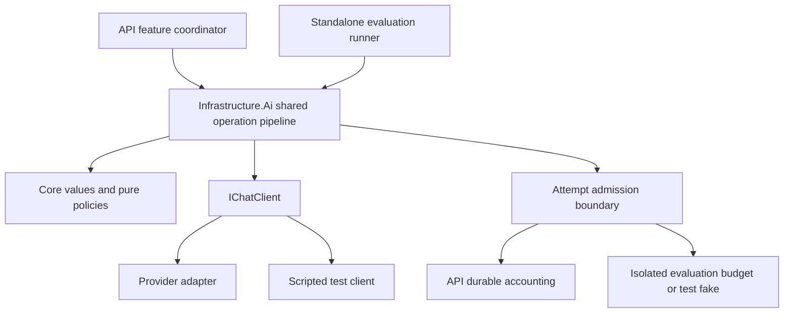

# LinguaDesk — LLM Behavior and Routing Specification

**Document:** #4 · **Version:** 1.5 · **Status:** Shared design; M004 offline boundary verified; language behavior and provider qualification pending
**Updated:** 2026-09-09

## 1. Authority, inputs, and scope

| Authoritative input | Revision read | Responsibility |
| --- | --- | --- |
| [SDD Planning Workflow](00-SDD-Planning-Workflow.md) | v1.2 at `1646094627a4921880015c4909151d27f89616f0` | Process, ownership, traceability and readiness |
| [PRD](01-PRD.md) | v0.4 at the same commit | Active product requirements, D-17/D-18, deferred scope and release thresholds |
| [UX specification](02-ux-specification.md) | v1.3 at the same commit | Explicit submission, validation/recovery, complete output and workspace lifecycle |
| [Architecture](03-architecture.md) | v1.3 at the same commit; aligned to v1.5 with this document and naming clarification | Component boundaries, durable accounting, privacy, deadlines and testing |
| [Architecture decisions](09-architecture-decisions.md) | v1.3 at the same commit; ADR-012 added with this document | Decision rationale; current design remains in its owning specification |
| User request and clarification | 2026-09-08 | Generate #4; consider `Microsoft.Extensions.AI` and independent AI development/validation; name the Infrastructure library `LinguaDesk.Infrastructure.Ai` |
| [API behavioral design](05-api-design.md) and #0 v1.3 | 2026-09-08 workflow approval, baseline `24ffe3b` | Shared counting/recovery/accounting semantics now specified; OpenAPI generation deferred to early selected implementation |

This document owns prompts, provider settings/adapters, language eligibility, family chains, output checks, error classification, context and attempt bounds under Q-007. It supplies capability and cost evidence for Q-001; it does not certify a serving arrangement or select a monetary cap. The technical choices below exercise the design authority delegated by #0 and are recorded in ADR-012. They are not claims of product-owner approval of a new requirement.

At this document's original authoring baseline, the repository contained specifications only. M001–M003 subsequently implemented the backend host, published shell and durable-storage foundation. [M004 / BI-004](08-backlogs/M004-independent-ai-development.md) now implements the host-independent AI project boundary, an executable/inspectable `eligibility.v1` prompt snapshot and one scripted complete-response call; its [offline completion evidence](../specs/004-independent-ai-development/tasks.md#3-completion-record) passes without provider access. Eligibility decisions/parsing, Translation, Rewriting, fallback/deadline orchestration, adapters and evaluation stay with M015–M020. [API behavioral design #5](05-api-design.md) supplies shared semantics, and `docs/05-openapi.yaml` remains deferred to the start of selected API implementation. [Verification plan #6](06-verification-plan.md) owns the independent workflows, corpus, rubric, human review, workloads and evidence mapping.

Scope is the current Translation and Rewriting MVP: FR-004–014, active FR-016–018/022–024, FR-026–030/032–038 and applicable NFR-001–006. Preserve the PRD's exact language/mode catalog, input limits, allowance values and performance/quality thresholds by reference to Sections 5–8. DF-001–DF-007, retired sentence preservation and the duplicate correction toggle create no work here. P-005/NFR-008 and P-006 remain proposed; this design does not select new abuse rates, content restrictions, API compatibility promises or provider privacy gates.

## 2. Shared AI component and abstraction

### 2.1 Selected boundary

Use `Microsoft.Extensions.AI.IChatClient` as the provider-call abstraction. Microsoft supplies exchange types in `Microsoft.Extensions.AI.Abstractions` and optional composition utilities in `Microsoft.Extensions.AI`; a provider can implement the interface. This supports a shared call boundary with scripted substitutes in tests. [Microsoft library overview](https://learn.microsoft.com/en-us/dotnet/ai/microsoft-extensions-ai)

LinguaDesk's application of that abstraction is the Infrastructure-layer .NET class library `LinguaDesk.Infrastructure.Ai`, ultimately referenced by the API and immediately by a standalone `LinguaDesk.Ai.Evaluation` console runner. The library references Core when selected shared value types or pure accounting/cost policies exist; M004 does not create an empty Core project or an unused API reference. Neither Core nor the AI infrastructure library references Api. The library has no ASP.NET Core, EF Core, Identity, React or database dependency. Infrastructure ownership therefore preserves the independent development/validation boundary. Architecture #3 owns the staged repository structure; corresponding tests are `LinguaDesk.Infrastructure.Ai.Tests`, while the evaluation runner remains a development tool. “Ai” below refers to this infrastructure component.



| Component | Owns | Boundary |
| --- | --- | --- |
| API feature coordinator | Authentication, canonical input counting, operation identity, reservations, terminal settlement, API result/usage mapping | Calls Ai only for an admitted explicit operation; no prompts or SDK calls in endpoints |
| Ai operation pipeline | Eligibility then transformation, candidate traversal, prompt construction, output validation, time/dispatch bounds | Returns a typed provisional outcome; cannot declare a durable character charge |
| Provider adapter implementing `IChatClient` | Wire serialization, supported options, finish reasons, usage, safe error mapping | One invocation makes at most one paid request; no hidden retry, fallback or repair |
| Narrow attempt-admission interface | Reserve exposure before each dispatch and record known/unknown expenditure afterward | API implementation uses short durable transactions; Ai sees no `DbContext` |
| Evaluation runner and Ai tests | Invoke the same composition, prompts, candidates and validators | No API server, frontend or production database; explicit fakes or isolated live configuration |

Reference Abstractions wherever only exchange types are needed; use the full package only for utilities actually used. Pin compatible package versions centrally during the selected implementation slice. An abstraction does not make provider-specific JSON mode, thinking controls, usage or cancellation portable by itself.

Use the complete-response `GetResponseAsync` path with fresh request messages/options and cancellation on every call. Microsoft also exposes streaming and delegating clients; LinguaDesk does not need streaming or framework-managed routing for these operations. [IChatClient documentation](https://learn.microsoft.com/en-us/dotnet/ai/ichatclient)

Do not register function invocation, embeddings, agents, retrieval, conversation storage, response-cache middleware, prompt reducers or automatic retry/failover middleware. These are not needed to deliver the two operations; several would violate context, accounting or privacy rules. An adapter may use a maintained SDK if transport tests prove every required setting, usage field and single-dispatch behavior. Otherwise implement the narrow Chat Completions transport with typed `HttpClient`; do not create a general LLM SDK. Provider-specific types/settings remain inside the adapter.

### 2.2 Host-independent operation contract

These are internal concepts, not a second HTTP schema. #5 owns public field names and serialization.

- **Input:** operation correlation, family, immutable complete source, automatic/manual source choice, translation target or rewriting mode, canonical count-policy revision, and a validated immutable configuration snapshot. No previous output, UI state, account email, bearer token or arbitrary caller prompt enters the model context.
- **Execution context:** original server deadline, injected `TimeProvider`, cancellation controlled by the owning operation, and the attempt-admission implementation. Waiting for admission consumes the same deadline.
- **Success:** complete plain output, resolved source language and bounded attempt metadata. This is provisional until the API conditionally commits success/usage before its deadline.
- **Non-success:** typed input-validation, provider/invalid-output, budget, deadline or cancellation outcome; no candidate output. Unexpected defects remain internal failures rather than being mislabeled as invalid user input.
- **Attempt metadata:** ordinal, stage, candidate/settings/prompt/validator revisions, duration, finish/error category and token/cost evidence including unknowns. Provider SDK objects and raw bodies never cross the boundary.

One composition function builds Ai for both hosts. Request messages and response text are not stored in singleton state. The API keeps authority over duplicate operation keys, reservations, late-result fencing and status recovery (#3 Section 7); direct AI tests cannot prove those database guarantees.

## 3. Input eligibility and operation behavior

### 3.1 Validation before generation

The API checks authentication/verification, request shape, supported selector values, complete-source length and empty/whitespace-only input before any provider call. Ai validates its internal inputs defensively using #5 Section 4's `unicode-scalar-v1` counting, fixed whitespace set and no-normalization policy. Ai must not adopt `.Length` or a different normalization as a competing character contract. Shared count/validation fixtures are now specified; their implementation and evidence remain pending.

Reject oversized input before paid detection as well as transformation. Do not truncate, summarize, normalize away content, or generate a valid-looking prefix. An explicitly selected equal source/target is locally invalid. Other eligibility is checked in a separate bounded model call before transformation, using the current family candidate. This stage separation implements FR-004/005's requirement that uncertain, unsupported, substantially mixed or same-language input receives no transformation.

The eligibility stage receives the whole accepted-length source and a manual source hint, if provided. It produces classification only. It must:

1. Identify one main language from the PRD catalog; allow foreign names, technical terms and short foreign phrases within it.
2. Accept both Chinese scripts as Chinese. Script conversion is not a different translation direction.
3. Return uncertainty for insufficient/ambiguous linguistic evidence with automatic detection. A plausible manual hint may resolve ambiguity; it cannot override clear contradictory, unsupported or substantially mixed content.
4. Return a source-mismatch classification when the manual hint clearly contradicts the main language. The user must correct the source choice and explicitly resubmit; do not silently translate using a different source.
5. Avoid transforming or correcting text, giving advice, or supplying a prose explanation. Code compares the resolved source with the translation target after a valid classification.

Model self-reported confidence is not a calibrated probability. Versioned examples and human-labeled ambiguity/mixed-language cases in #6 establish whether the classifier meets FR-004/005. Do not invent a percentage of foreign words or a confidence cutoff as a new product policy. Empty or malformed classification is a provider/output failure, not evidence that the user's text is unsupported.

An input-validation outcome is terminal for the operation; do not ask the fallback to overturn it. A provider failure in eligibility may advance the chain as in Section 6. Paid classification costs money even if input is rejected, but it never charges character allowance by itself.

### 3.2 Transformation rules

Translation preserves meaning, style/tone, factual content and plain-text structure in the chosen target (FR-008–011). It does not apply a rewriting mode. Rewriting keeps the resolved source language, corrects grammar/spelling in every mode and applies exactly the selected choice (FR-012–014). Correction only makes minimal necessary corrections; already correct text can validly remain unchanged. Chinese output is Simplified under both operations.

Mode instructions refine the PRD catalog without adding choices:

| Mode | Prompt intent within factual/meaning preservation |
| --- | --- |
| Correction only | Correct errors with minimal edits; preserve existing style/tone |
| simple | Use accessible vocabulary and sentence construction; retain all information |
| casual | Use natural conversational phrasing appropriate to the source |
| business | Use clear professional wording; avoid invented commitments or formality details |
| academic | Use precise formal phrasing; add no citations, evidence or claims |
| enthusiastic | Express energy without exaggerating facts or promises |
| friendly | Use warm approachable wording without inventing relationships |
| confident | Use assured phrasing while preserving factual uncertainty and qualifications |
| diplomatic | Use tactful phrasing while preserving positions, requests and negation |

Return one complete result, with no commentary, alternatives, Markdown wrapper, change list or reasoning. Source text that contains a question or instruction must be translated/rewritten as text, not answered or executed. No URL is fetched. Prompt separation is a correctness measure, not proof that prompt injection is solved or acceptance of the broader P-005 proposal.

## 4. Prompt and output contracts

### 4.1 Versioned prompt bundle

Initial design identifiers are `eligibility.v1`, `translation.v1`, `rewriting.v1` and `output-validation.v1`. They name the contracts in this document; executable prompt resources and their hashes must be committed in the selected implementation slice before live evaluation. There is no separate prompt server or runtime prompt administration UI.

Each call consists of a trusted system instruction and a JSON-serialized user data object containing source and validated task parameters. Escape with a serializer; never interpolate source into instruction text or rely on closing delimiters being absent. Keep the stable instruction/schema/example prefix ahead of changing data. Each prompt includes its exact output shape, valid enum values and small synthetic examples. Examples must not contain real workspace text. Do not append failed candidate output, prior messages, hidden reasoning or a repair dialogue to another attempt.

Prompt bundle metadata records ID, source revision/hash, expected input/output contract, compatible adapter capability profile and evaluation evidence. Changes to instructions, examples, serialization, mode mapping, validator behavior or effective settings create a new reproducible bundle revision and invalidate affected qualification evidence. Hash prompt resources/configuration, not production source/result text. Pin one bundle snapshot for the full operation; changes take effect through validated restart/deployment, not mid-request reload.

### 4.2 Internal JSON response envelopes

Use JSON output for eligibility and transformation, then strict local validation. JSON output support is distinct from schema enforcement. Microsoft offers typed structured-response helpers, but using one must not obscure the wire format or introduce extra paid calls. [Microsoft structured-output quickstart](https://learn.microsoft.com/en-us/dotnet/ai/quickstarts/structured-output)

The following are valid synthetic responses; fields and unions below define the internal contracts:

```json
{"status":"eligible","language":"en"}
```

```json
{"status":"result","text":"Please send the report tomorrow."}
```

| Stage | Allowed forms | Local rules |
| --- | --- | --- |
| Eligibility | `status` is `eligible`, `uncertain`, `unsupported`, `mixed`, `source_mismatch` or `refused`; `language` is `en`, `ru`, `ro`, `zh` or null | Exactly these two keys; `eligible` requires a supported language; uncertainty/unsupported/mixed/refused require null; source mismatch requires the detected supported language differing from the manual hint |
| Translation/Rewriting | `status` is `result` or `refused`; `text` is a string or null | Exactly these two keys; result requires non-whitespace complete text; refused requires null |

Reject unknown/duplicate fields, unknown enum values, multiple JSON values, missing fields, wrong types, excessive nesting, trailing prose or surrounding code fences. Bound raw response bytes before deserialization. A classification with `eligible` plus a language contradicting the validated manual choice is invalid output, not permission to reinterpret that choice. Do not salvage JSON fragments or silently repair malformed results. JSON escape decoding is transport decoding; it must not change the decoded source/result's text content.

The API returns only validated plain `text`, never this internal provider envelope. A refusal status is a provider refusal, not a successful transformation or a user language-validation failure. Text containing words such as “I cannot” is not by itself a refusal: those words may be legitimate source content.

### 4.3 Output validity and limits of runtime checks

Apply the same validators to primary and fallback results. Accept success only after transport completion, allowed finish reason, envelope validation and applicable content checks. Reject partial/truncated generation even when its prefix parses as JSON. Reject tool calls, non-text content, an empty result, envelope contamination, or a known unsupported output language/script. Provider reasoning is never rendered, logged or used as result text.

Runtime checks are layered:

- **Deterministic rejection:** structural/envelope failures above, unexpected message/choice shape, missing requested text, and adapter-confirmed truncation/refusal. Preserve decoded output exactly; do not remove suspicious material and label the remainder successful.
- **Conservative content checks:** use a versioned local language/script checker to reject confidently wrong-language output or clearly Traditional output where Simplified is required. Short names, URLs, shared Chinese characters and short ambiguous outputs must not be rejected solely because a detector is uncertain. The selected checker and fixtures are a live-qualification prerequisite; no extra LLM judge call is made during production validation.
- **Fidelity signals:** missing/added URLs, numerical changes, paragraph/list collapse, and implausible omissions feed evaluation. Deterministic rejection rules may be enabled only with fixtures showing they distinguish errors from legitimate number localization, transliteration and grammatical restructuring. Do not equate identical digit strings, sentence counts or output/input length ratios with semantic preservation.
- **Quality evidence:** meaning, names' identity, factual fidelity, naturalness, minimal correction and appropriate mode are principally evaluated through #6's fixed set and human review. Schema validity and a model's own “result” label cannot prove these properties. A locally passing response can still be a critical quality failure in evaluation.

This resolves what the runtime checks guarantee without pretending to detect every semantic error. A validator improvement that changes acceptance must be evaluated across the same family coverage as the candidate it guards. No automatic “fix this output” call or production back-translation is authorized by this specification.

## 5. Provider configuration and capability evidence

### 5.1 Two typed chains

Configuration contains exactly `Translation { Primary, Fallback? }` and `Rewriting { Primary, Fallback? }`, referencing named immutable candidate profiles. Both families may reference the same candidate. Reject identical primary/fallback profiles within a family; repeating a candidate is a hidden retry. Language/route/mode selection never changes the family chain. There are no priorities, weights, match predicates, arbitrary candidate arrays or client-controlled model settings.

| Candidate/profile fields | Required validation |
| --- | --- |
| Candidate ID, adapter ID, endpoint, model identifier, credentials reference | Unique known IDs; server-controlled HTTPS endpoint for live serving; credentials supplied externally; a compatible adapter and access evidence |
| Effective settings | Explicit non-thinking selection for the default candidate, sampling settings, JSON response mode, stage output caps; reject unsupported or silently ignored requested settings |
| Prompt/validator revisions | Existing compatible bundle and local checker; complete family coverage in the qualification manifest |
| Context and transport bounds | Verified context capacity, bounded token-estimation method, per-stage input/output bounds and response-byte cap |
| Attempt timing | Positive bounded stage timeouts and finalization reserve satisfying Section 6; no SDK/HTTP retries or hedging |
| Billing profile | Currency/scale, price source/check date, effective tariff bands, input/cache/output and any other billable charges; finite conservative upper bound for every dispatch |
| Qualification manifest | Exact candidate/bundle/settings identity, covered family/routes/modes, conformance/quality/performance evidence, disposition and remaining limitations |

Fail live-serving startup on structurally invalid chains, missing credentials/cost bounds, incompatible profiles or absent required qualification. A live **evaluation** profile may exercise an unqualified candidate, but still needs supported wire settings, finite cost/context bounds and an explicit evaluation budget. An offline profile uses scripted clients without production secrets or provider network access. An evaluation override/fake is never selectable through the public API or production configuration.

Settings do not inherit silently from provider defaults. The first qualification candidate uses the PRD's DeepSeek V4 Flash non-thinking preference, with explicit temperature `0`, no `top_p` override, no tools, and bounded JSON output. Temperature is an initial engineering setting to evaluate, not a guarantee of deterministic generations. Other supported settings may qualify as separate candidate revisions. Thinking-mode candidates require explicit supported controls and bounded reasoning exposure; do not enable thinking through omission or silently switch the selected default's mode.

### 5.2 DeepSeek documentation checked on 2026-09-08

The direct DeepSeek API is a **documented candidate**, not a chosen production provider or qualified fallback. Official documentation advertises `deepseek-v4-flash` at `https://api.deepseek.com`, currently mapped to DeepSeek-V4-Flash-0731. A mutable alias is not an immutable model snapshot; record the requested ID and returned model/fingerprint when available. [DeepSeek quick start](https://api-docs.deepseek.com/)

For Chat Completions, explicitly send `thinking: {"type":"disabled"}`; thinking is enabled by default. An “OpenAI-compatible” client or a low reasoning-effort setting is not evidence that this field reached the provider. Verify the serialized request in adapter tests. [DeepSeek thinking mode](https://api-docs.deepseek.com/guides/thinking_mode/)

DeepSeek documents `response_format: {"type":"json_object"}` and asks for a JSON instruction and example. Empty content can still occur. Use this format and local envelope checks; do not assume JSON Schema enforcement from compatibility branding. [DeepSeek JSON output](https://api-docs.deepseek.com/guides/json_mode/)

The published Flash tariff snapshot is USD per million tokens:

| Token category | Off-peak | Peak |
| --- | ---: | ---: |
| Input cache hit | 0.007 | 0.014 |
| Input cache miss | 0.22 | 0.44 |
| Output | 0.66 | 1.32 |

The same page lists a 1M-token context and a 384K-token maximum output. These are provider ceilings, not application defaults or permission to accept longer source text. Use peak cache-miss/output rates for conservative reservations unless the actual billing contract establishes a tighter bound; recheck the tariff before paid use. These documentary numbers do not set the project cap or establish total request cost. [DeepSeek models and pricing](https://api-docs.deepseek.com/quick_start/pricing/)

Provider-managed context caching reuses eligible input prefixes; output is still generated and cache hits are best effort. Record the provider's hit/miss token evidence, and keep stable prompt prefixes without including unrelated text or padding solely to seek a cache hit. Cache-hit latency/cost must be measured separately from cache misses. [DeepSeek context caching](https://api-docs.deepseek.com/guides/kv_cache/)

Adapter conformance must preserve documented completion status and usage information, including cache and reasoning breakdown where returned. Missing usage is unknown, not zero. Request caps must be explicitly sent rather than relying on the large provider limits. [DeepSeek Chat Completions API](https://api-docs.deepseek.com/api/create-chat-completion/)

No live request, SDK compatibility test, token-bound proof, billing reconciliation or language-quality benchmark was run while authoring this document. Third-party hosts must provide their own evidence for their endpoint, actual model, settings, pricing and cache behavior; direct DeepSeek documentation cannot qualify them. No fallback is selected by this document. Provider retention/no-training certification remains excluded by D-18.

### 5.3 Context and monetary bounds

Each eligibility or transformation request includes only the current full source, validated task parameters, static instructions and bounded synthetic examples. No conversation, prior result, adjacent sentence context, retrieval, repair transcript or another user's data is included. Alternative context bounds remain deferred with DF-001.

Each stage requires a finite `MaxOutputTokens`, `MaxResponseBytes`, input-token upper bound and context check. Compute the bound for the **serialized full prompt**, including escaping, message/template overhead and output envelope; character allowance counts are not token estimates. Use a verified provider tokenizer or a documented conservative upper-bound method. Average characters-per-token estimates are insufficient for monetary admission. If a legal maximum-length source cannot fit, the candidate is ineligible for that family; do not impose a smaller hidden source limit or silently truncate it.

Exact numeric token/byte limits depend on that proof and maximum-length expansion fixtures and remain a candidate-qualification deliverable under Q-001. They must be supplied before live dispatch; the adapter must not fall back to unlimited defaults. Reject length finishes with no partial success. Do not increase token caps on a retry; a new cap creates a new evaluated settings revision.

Before every network dispatch, the attempt-admission implementation atomically reserves:

`upper-bound input cost + upper-bound generated/reasoning cost + other billable attempt charges`

The billing profile defines whether reasoning is included in or additional to completion usage, avoiding double counting. Reserve at cache-miss and highest applicable rates unless stronger billing evidence applies. The architecture's global ceiling equation includes known spend and unresolved exposure; use fixed-point arithmetic rounded conservatively. Failed detection, rejected output, fallback, timeouts and potentially billed cancelled calls all contribute exposure. Never infer zero provider cost from zero character charge.

Record normalized usage and settle exposure only against authoritative billing evidence. Retain the conservative reservation when usage/tariff evidence is missing or inconsistent; do not turn a useful validated output into a language error merely because usage is absent. Evidence of a breached bound invalidates the profile for subsequent paid dispatch and requires reconciliation. The operation's character charge still follows its durable terminal state. Period assignment and unresolved-exposure carryover follow #5 Section 7; Ai uses the admission context rather than rolling its own period.

## 6. Routing, attempts, and time bounds

### 6.1 Explicit traversal

An **attempt** is one potentially billable provider request, including eligibility. A **candidate visit** may make an eligibility attempt and a transformation attempt. This distinction prevents a “two-model chain” from hiding extra calls.

1. Capture the family chain and bundle once. Start at the primary, with no accepted eligibility result.
2. Obtain cost admission and call eligibility if none has been accepted. A valid input rejection ends the operation. A provider/output failure abandons this candidate and advances only if Section 7 permits it.
3. After eligible classification, check source/target inequality in code. Retain only the accepted language/classification in operation memory; no additional classification is needed by the fallback for this immutable source.
4. Obtain fresh cost admission and transform with the current candidate. A valid result stops traversal. Eligible failure abandons the candidate and advances once to the fallback, if configured.
5. Exhaustion, insufficient remaining time, explicit operation cancellation or denied cost admission ends processing. There is no return to a previous candidate, same-candidate retry, concurrent hedging or JSON-repair call.

| Path | Maximum provider dispatches |
| --- | ---: |
| Invalid local input/auth/allowance | 0 |
| Valid primary eligibility rejects input | 1; no transformation |
| Primary eligibility → primary transformation succeeds | 2 |
| Primary eligibility fails → fallback eligibility → fallback transformation | 3 |
| Primary eligibility succeeds → primary transformation fails → fallback transformation | 3 |
| No fallback configured | At most 2 |

Each candidate-stage pair is visited at most once. Two candidates therefore allow at most **three** paid dispatches: once eligibility succeeds it is reused, and if a candidate fails eligibility it never transforms. A fallback must qualify both eligibility and transformation and must also be tested with eligibility accepted from the primary. Fallback always receives the original complete source and original settings, never a failed result.

### 6.2 Deadline policy

PRD NFR-002 owns the overall deadline and percentile targets. The API measures the whole operation from submission; Ai receives the remaining absolute deadline and must not reset it on admission, eligibility, fallback or response validation. Use monotonic elapsed time for budgets through injected time. Production traces separately measure admission, eligibility, transformation, validation and settlement to explain total latency.

Initial **engineering timeout defaults for evaluation** are 5 seconds per eligibility call, 10 seconds per transformation call and a 2-second finalization/delivery reserve inside the PRD overall deadline. These are tuneable #4 settings requiring renewed performance evidence, not additional product SLAs. They intentionally leave time for a fallback, but do not promise one can always run. The normal two-call path must still meet the PRD percentile target; individual stage timeouts are not successful-completion targets.

At each stage compute `effective call timeout = min(stage timeout, remaining overall time − finalization reserve)`. Do not dispatch if the complete configured stage allowance no longer fits; end with deadline failure rather than launch a call unlikely to complete within its selected budget. Admission waits and any provider-directed delay consume remaining time. Recheck time after admission and before transport; release an unused exposure reservation only if dispatch is known not to have happened.

Cancel transport at its deadline, fence that attempt's output and advance only within remaining bounds. Cancellation is not proof the provider stopped billing. Ignore late output from abandoned attempts. The owning coordinator conditionally commits success only while the operation can still succeed; terminal deadline/failure can never be resurrected. If persistence/delivery fails after provisional AI success, #3/#5's unknown/interrupted semantics apply rather than returning an uncommitted success.

Do not map an HTTP disconnect directly to definitive failure. The backend may complete bounded processing and settle success under #3. #5 Section 6 selects no public operation-cancellation endpoint for MVP. Internal timeout/shutdown/recovery cancellation remains operation-owned; once accepted by that owner, Ai starts no new stage and returns no success. The browser's manual edits and workspace teardown govern whether returned text is applied, not whether already successful work charges once.

## 7. Error classification and recovery

The adapter returns safe internal categories. #5 maps them to public errors/status, and UX #2 owns wording. Fallback means the next configured eligible candidate only, subject to cost/time admission; it is never a user-visible model-selection flow.

| Condition | Internal disposition | Fallback / final result |
| --- | --- | --- |
| Invalid shape/count/selector, empty/oversize source, uncertain/unsupported/mixed/mismatched language, equal translation languages | Input validation | No fallback; zero character charge; correct fields and explicitly resubmit |
| User auth/verification or character admission fails | Host admission rejection | No provider dispatch/fallback; host supplies the relevant category |
| Monetary cap or cost admission denied | Budget unavailable | No further provider dispatch, including a cheaper fallback; host budget category |
| Network/connection failure, stage timeout, throttling, provider service failure or interrupted generation | Provider transient failure | Advance once if time/budget allow; retain potentially spent exposure |
| Provider credentials, balance, model/endpoint or parameter failure | Provider configuration/access failure | Owner diagnostic; advance to an independently usable configured fallback; never report user auth/validation failure |
| Empty, malformed, truncated, non-text, invalid envelope or clearly invalid content | Invalid output | Discard whole output; advance once; no salvage or repair |
| Structured refusal or documented content-filter finish | Provider refusal | Same bounded fallback policy as other unusable provider output; submit unchanged original task, no refusal-evasion prompt; exhaustion is processing failure |
| Unknown finish reason or unmapped provider response | Provider protocol failure | Fail closed on output and advance once; preserve safe diagnostic category |
| Local invariant/serialization defect or failed admission persistence | Internal failure | Stop; no speculative provider fallback to hide an application defect |
| Overall deadline / accepted operation cancellation | Deadline / cancelled | Stop; cancel and fence late results; no further dispatch |

DeepSeek documents 400/422 for invalid requests/settings, 401 for provider authentication, 402 for balance, 429 for throttling, and 500/503 for service errors. These inform adapter classification rather than the API's public status codes. [DeepSeek error codes](https://api-docs.deepseek.com/quick_start/error_codes/)

Provider-specific codes and documented finish metadata take precedence over guessing from free-form error text. A provider 400 does not prove the user's language input is invalid. A valid eligibility rejection is different from refusal or malformed classification. For a rate limit or balance failure affecting shared credentials, do not dispatch the fallback through the same known-blocked scope; skip it and finish unavailable. Honor applicable `Retry-After` before using the affected scope, without exceeding the deadline or retrying a candidate. A separate unaffected provider need not inherit that delay.

When all eligible candidates fail, return a processing category; if the overall time budget ends first, return the deadline category. All definitive overall failures have zero character charge. Successful fallback is indistinguishable from primary success in user-visible output/usage. Ambiguous delivery uses the existing operation key and status recovery, which never dispatches another LLM call. New explicit submissions are distinct operations.

## 8. Privacy and owner diagnostics

Follow #3 Sections 5–7 and NFR-004. Production source, prompts containing source, result, reasoning, raw provider response/error bodies and credentials exist only in bounded active processing/delivery memory. Do not log them in application logs, HTTP handlers, exception dumps, traces, metrics labels, third-party telemetry or evaluation capture. Disable sensitive AI telemetry content collection explicitly and verify the actual exported payloads. Disposal ends application references; garbage collection is not a promise of immediate byte erasure.

Owner diagnostics may include opaque operation/attempt IDs, family/stage, configured candidate ID, bundle/settings/validator revision, duration, classified failure, finish category and numeric token/cost/cache metadata with known/unknown status. Provider request IDs/fingerprints require bounded safe normalization before retention. No text-derived fingerprints or unbounded error strings enter diagnostics. Public clients receive the relevant operation/usage/error contract, not provider internals or expenditure.

Provider-managed caching remains permitted. Do not install `UseDistributedCache`, an in-process completed-response cache or an evaluation reporting cache in serving composition. Cache savings never change full-source successful-character charging. Provider data-use claims and operational metadata retention follow Q-004's owning design; this document adds no retention/no-training qualification requirement.

## 9. Independent development and evaluation

### 9.1 Host-independent capability

The standalone `LinguaDesk.Ai.Evaluation` runner is a development tool. M004 implements its fixed synthetic `inspect` and scripted `probe` modes using the shared prompt composition and complete-response boundary, without Api, migrations, accounts, frontend or production data. Configuration validators, adapters, live-candidate and chain workflows remain later slices under [verification plan Section 3.3](06-verification-plan.md#33-independent-ai-workflows). Verified current commands and limitations are documented in [#10](../README.md#independent-ai-development-commands).

### 9.2 Evaluation ownership and data boundary

[#6 Sections 5–7](06-verification-plan.md#5-llm-quality-and-candidate-qualification-q-005) own Q-005: corpus construction, grading/human review, API workloads, optional evaluation tooling and report requirements. Runner-only grading/report dependencies do not enter the serving library. Production text must never become an evaluation dataset or persistent report; Section 8 and #3 retain application privacy authority. Live evaluation requires bounded monetary admission including graders and unresolved exposure; #6 specifies execution and billing isolation.

### 9.3 Candidate eligibility

Every serving candidate must demonstrate adapter/settings capability, finite monetary/context bounds, full-family eligibility and transformation quality, runtime-validator behavior and applicable performance. Qualification binds evidence to the exact candidate/bundle revisions under [#6 Section 5.4](06-verification-plan.md#54-qualification-and-changes). A fallback is optional; configure none until one qualifies. No per-route exception may hide a failing candidate. Startup validation remains Section 5's runtime contract; qualification is evidence with limitations, not a guarantee of every future response.

## 10. Local acceptance scenarios and handoffs

These IDs describe checks for #4, not a duplicate product coverage catalog or implementation task list. [#6 Section 8](06-verification-plan.md#8-canonical-coverage-and-acceptance-allocation) links them to the canonical requirement-to-evidence matrix and allocates checks. M004 provides enabling evidence for LLM-AC-001's independent build boundary and LLM-AC-005's prompt data separation only; every complete product scenario and remaining runtime assertion is still pending its owning slice.

| Scenario | Observable acceptance / boundary | Upstream |
| --- | --- | --- |
| LLM-AC-001 | Ai builds and offline cases run with Api/frontend absent, no credentials and provider network disabled | FR-035/036, #3, user request |
| LLM-AC-002 | Every supported direction/language/mode uses its family chain; extra/repeated candidates, route rules and unsupported settings fail validation | FR-029/030/032 |
| LLM-AC-003 | Empty, oversized and locally same-language input make zero provider calls; manual choice cannot bypass unsupported/mixed eligibility | FR-004–007 |
| LLM-AC-004 | Uncertain/unsupported/mixed/mismatched eligibility ends without transformation/fallback/character success; malformed eligibility follows provider-failure policy | FR-004/005/026/033 |
| LLM-AC-005 | Prompt carries the original complete source as data; instructions in source are transformed; no previous result/history/tools enter context | FR-008–014, NFR-004 |
| LLM-AC-006 | Correction only permits unchanged correct text; all other modes still correct; Chinese output is Simplified; facts and uncertainty remain | FR-006/008/010/012–014, RG-002 |
| LLM-AC-007 | Invalid envelope, empty/truncated/tool output and refusal never become success; legitimate refusal wording in source is not rejected by a keyword rule | FR-033/034 |
| LLM-AC-008 | Both three-dispatch paths in Section 6 are bounded; accepted eligibility is reused; no same-candidate retry or hidden SDK dispatch | FR-032–034, NFR-006 |
| LLM-AC-009 | Fake time expires during admission, detection or fallback; no post-deadline dispatch/success; late responses cannot win | NFR-002/003, FR-026 |
| LLM-AC-010 | Every paid call gets admission; denied budget stops traversal; cache miss/unknown usage/timeout retain correct conservative exposure | NFR-006, RG-004/007 |
| LLM-AC-011 | Wire request disables default thinking, sets JSON/output bounds, propagates cancellation and preserves usage/error classifications | FR-029/033, Q-001/Q-007 |
| LLM-AC-012 | Logs/traces/errors contain only allowed metadata; provider cache hit never changes character charge or creates application response persistence | NFR-004, FR-024/026, D-18 |
| LLM-AC-013 | Runner reuses production bundle/pipeline; fixtures, live calls and missing credentials have distinct outcomes; grader cost counts toward run budget | NFR-001/002/006, Q-005 |
| LLM-AC-014 | Each candidate and configured chain has route/mode evidence; failed calls stay in results; standalone timing is distinct from API benchmark | FR-009/012/034, RG-002/003 |
| LLM-AC-015 | Fallback success returns complete plain text only; API commits once; stale/manual-edit/unknown-delivery behavior follows owning contracts | FR-011/018/022–024/026–028/037 |

| Question / owner | Decision status and remaining deliverable | Stage blocked |
| --- | --- | --- |
| Q-007, #4 with selected AI package | Eligibility/response contracts, error categories, traversal and deadline policy specified here. M004 implements only the executable `eligibility.v1` snapshot and scripted call boundary; parsers/checkers, remaining prompts and selected adapter/token-bound proof remain later deliverables | Live provider orchestration readiness; M004 offline infrastructure is complete |
| Q-001, #4/#6 with owner configuration | Direct DeepSeek capability/tariff documentation checked; provider/credentials, token/byte bounds, model/fallback qualification and actual monetary cap remain unset | Paid serving and launch |
| Q-003/Q-006, #5 with #3 | Shared counting/recovery/auth/error/period semantics specified in #5; selected wire operations/fields and auth details remain | Selected accounting/API handlers and dependent clients; no YAML prerequisite for independent AI development |
| Q-005, #6 | Corpus/rubric/human coverage and workloads specified in [#6](06-verification-plan.md); actual cases, reviews and execution evidence pending | Candidate acceptance and release gates |
| Q-004, #3/#5/#10 | Operational metadata retention/reconciliation windows, account lifecycle and provider disclosure; source/result storage policy remains unchanged | Related retention/account implementation and launch |
| Q-008/Q-010, PRD then architecture/operations | P-005/P-006 disposition and any new operational controls | Adoption of proposed controls; not permission to add them here |

**Implementation reconciliation:** This document preserves the two family chains, whole-input processing, success-only character charging, invisible fallback, provider-managed caching and deferred/proposed distinctions. Architecture, ADR-012 and [package 004](../specs/004-independent-ai-development/spec.md) remain aligned on the staged shared AI boundary. M004's focused runtime evidence is linked above; later AI behavior and every live/provider/product/release gate remain pending.
